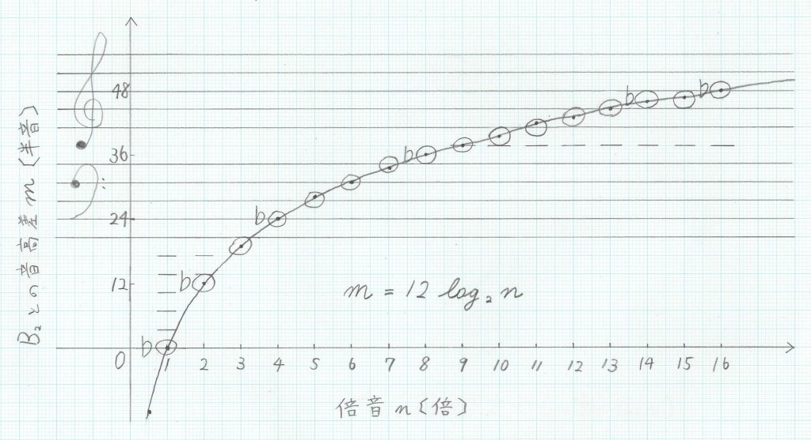

チューバが上手くならない.
上達するには練習しなければならない.
練習するにはカラオケへ行かねばならない.
カラオケ代もバカにはならない.
ということでチューバについて色々とまとめる.
ここでのチューバとは,
私の持っているB管4ロータリーチューバのことを指す.

## チューバの基本概念

チューバとは,
大雑把に言えば
倍音の倍数 $n$, 運指 $F$ から音 $T$ が決まる写像である.
当然奏法だったり色々音色を変える術はあるだろうが,
音だけで言えば非常に物理的な性質を持った楽器である[^phys].
[^phys]: 当然, 任意の楽器にも言えることで, チューバだけが特別なわけではない.

## 倍音

チューバの本質は, 両端が開いた管である.
管は [固有振動数](https://ja.wikipedia.org/wiki/%E5%9B%BA%E6%9C%89%E6%8C%AF%E5%8B%95) $\omega_n$ を持ち,
マウスピースでの唇の振動がそれと一致したときに,
管内で定常波となって共鳴する.
倍音の倍数 $n$ に対し,
出る音の $\sf{B_2}$ からの音高差 $m$ [半音] は,
$$
m = 12 \log_2 n
$$
と表される.

倍数 $1, \dots, 16$ について,
$m$ とそれに対応する音 $T$ についてまとめた音が次の表である.
一般的に用いられる倍音 $n=2,3,4,5,6,8,\dots$ は音との音高差が比較的近いことがわかる.

| 倍音 $n$ [倍] | $\sf{B_2}$ との音高差 $m$ [半音] |    音 $T$ [半音]    |
| :-----------: | :------------------------------: | :-----------------: |
|      $1$      |              $0.00$              | $\sf{B_2} \pm 0.00$ |
|      $2$      |             $12.00$              | $\sf{B_1} \pm 0.00$ |
|      $3$      |             $19.02$              |   $\sf{F} + 0.02$   |
|      $4$      |             $24.00$              |  $\sf{B} \pm 0.00$  |
|      $5$      |             $27.86$              |   $\sf{d} - 0.14$   |
|      $6$      |             $31.02$              |   $\sf{f} + 0.02$   |
|      $7$      |             $33.69$              |   $\sf{a} - 0.31$   |
|      $8$      |             $36.00$              |  $\sf{b} \pm 0.00$  |
|      $9$      |             $38.04$              |  $\sf{c^1} + 0.04$  |
|     $10$      |             $39.86$              |  $\sf{d^1} - 0.14$  |
|     $11$      |             $41.51$              |  $\sf{e^1} - 0.49$  |
|     $12$      |             $43.02$              |  $\sf{f^1} + 0.02$  |
|     $13$      |             $44.41$              |  $\sf{g^1} - 0.59$  |
|     $14$      |             $45.69$              | $\sf{as^1} - 0.31$  |
|     $15$      |             $46.88$              |  $\sf{a^1} - 0.12$  |
|     $16$      |             $48.00$              | $\sf{b^1} \pm 0.00$ |

また, 次の図は $n$ と $m$ のグラフにチューバの倍音列を重ねたものである.
五線譜は線の間隔が一定では無いために無理がある図であるが,
グラフと概ね一致していることがわかる.

## 運指

倍音に無い音を出すために, チューバには4個のロータリーバルブが付いている.
簡単のため,
$i$ 番ロータリーバルブの状態を $F_i \in \{0,1\}$ で表し,
$F = F_2 \times 2^0 + F_1 \times 2^1 + F_3 \times 2^2 + F_4 \times 2^3$ とする.
$i$ 番レバーを押したとき,
つまり $F_i = 1$ のとき,
息の経路に $i$ 番管が追加され,
管長が伸び, 固有振動数が大きくなる.

### 運指対応表(抜粋)

$(n, F) \mapsto T$ の対応は以下.

|  $F$  |     運指     | $n=$ |     $2$      |    $3$     |    $4$     |    $5$     |    $6$     |    $8$     |   $9$    |   $10$   |
| :---: | :----------: | ---: | :----------: | :--------: | :--------: | :--------: | :--------: | :--------: | :------: | :------: |
|  $0$  |     ○○○○     |      |  $\sf{B_1}$  |  $\sf{F}$  |  $\sf{B}$  |  $\sf{d}$  |  $\sf{f}$  |  $\sf{b}$  |          |          |
|  $1$  |     ○●○○     |      |  $\sf{A_1}$  |  $\sf{E}$  |  $\sf{A}$  | $\sf{des}$ |  $\sf{e}$  |  $\sf{a}$  |          |          |
|  $2$  |     ●○○○     |      | $\sf{As_1}$  | $\sf{Es}$  | $\sf{As}$  |  $\sf{c}$  | $\sf{es}$  | $\sf{as}$  |          |          |
| $3,4$ | ●●○○ or ○○●○ |      |  $\sf{G_1}$  |  $\sf{D}$  |  $\sf{G}$  |  $\sf{H}$  |  $\sf{d}$  |  $\sf{g}$  | $\sf{a}$ |          |
|  $5$  |     ○●●○     |      | $\sf{Ges_1}$ | $\sf{Des}$ | $\sf{Ges}$ |            | $\sf{des}$ | $\sf{ges}$ |          | $\sf{b}$ |
| $6,8$ | ●○●○ or ○○○● |      |  $\sf{F_1}$  |  $\sf{C}$  |  $\sf{F}$  |  $\sf{A}$  |  $\sf{c}$  |  $\sf{f}$  |          |          |
| $7,9$ | ●●●○ or ○●○● |      |  $\sf{E_1}$  | $\sf{H_1}$ |            |            |  $\sf{H}$  |            |          |          |

### 逆引き運指表(抜粋)

特定の音 $T$ を出したいときは以下の表.

|  $n$  | $\sf{E_1}$ | $\sf{F_1}$ | $\sf{Ges_1}$ | $\sf{G_1}$ | $\sf{As_1}$ | $\sf{A_1}$ | $\sf{B_1}$ | $\sf{H_1}$ | $\sf{C}$ | $\sf{Des}$ | $\sf{D}$ | $\sf{Es}$ | $\sf{E}$ | $\sf{F}$ | $\sf{Ges}$ | $\sf{G}$ | $\sf{As}$ | $\sf{A}$ | $\sf{B}$ | $\sf{H}$ | $\sf{c}$ | $\sf{des}$ | $\sf{d}$ | $\sf{es}$ | $\sf{e}$ | $\sf{f}$ | $\sf{ges}$ | $\sf{g}$ | $\sf{as}$ | $\sf{a}$ | $\sf{b}$ |
| :---: | :--------: | :--------: | :----------: | :--------: | :---------: | :--------: | :--------: | :--------: | :------: | :--------: | :------: | :-------: | :------: | :------: | :--------: | :------: | :-------: | :------: | :------: | :------: | :------: | :--------: | :------: | :-------: | :------: | :------: | :--------: | :------: | :-------: | :------: | :------: |
| $10$  |            |            |              |            |             |            |            |            |          |            |          |           |          |          |            |          |           |          |          |          |          |            |          |           |          |          |            |          |           |          |   $5$    |
|  $9$  |            |            |              |            |             |            |            |            |          |            |          |           |          |          |            |          |           |          |          |          |          |            |          |           |          |          |            |          |           |  $3,4$   |          |
|  $8$  |            |            |              |            |             |            |            |            |          |            |          |           |          |          |            |          |           |          |          |          |          |            |          |           |  $7,9$   |  $6,8$   |    $5$     |  $3,4$   |    $2$    |   $1$    |   $0$    |
|  $6$  |            |            |              |            |             |            |            |            |          |            |          |           |          |          |            |          |           |          |          |  $7,9$   |  $6,8$   |    $5$     |  $3,4$   |    $2$    |   $1$    |   $0$    |
|  $5$  |            |            |              |            |             |            |            |            |          |            |          |           |          |          |            |          |           |  $6,8$   |          |  $3,4$   |   $2$    |    $1$     |   $0$    |
|  $4$  |            |            |              |            |             |            |            |            |          |            |          |           |          |  $6,8$   |    $5$     |  $3,4$   |    $2$    |   $1$    |   $0$    |
|  $3$  |            |            |              |            |             |            |            |   $7,9$    |  $6,8$   |    $5$     |  $3,4$   |    $2$    |   $1$    |   $0$    |
|  $2$  |   $7,9$    |   $6,8$    |     $5$      |   $3,4$    |     $2$     |    $1$     |    $0$     |

## 全運指表

実用を無視して,
構造上考えられる全ての $(n, F) \mapsto T$ の対応をまとめてみる.

### 運指対応表

黄色字以外の音は理論的な音(ずれあり).

|   $F$   |     運指     | $n=$ |     $1$      |               $2$                |              $3$               |              $4$               |              $5$               |              $6$               |    $7$     |              $8$               |             $9$              |             $10$             |     $11$     |     $12$     |     $13$     |     $14$     |     $15$     |     $16$     |
| :-----: | :----------: | ---: | :----------: | :------------------------------: | :----------------------------: | :----------------------------: | :----------------------------: | :----------------------------: | :--------: | :----------------------------: | :--------------------------: | :--------------------------: | :----------: | :----------: | :----------: | :----------: | :----------: | :----------: |
|   $0$   |     ○○○○     |      |  $\sf{B_2}$  |  $\textcolor{yellow}{\sf{B_1}}$  |  $\textcolor{yellow}{\sf{F}}$  |  $\textcolor{yellow}{\sf{B}}$  |  $\textcolor{yellow}{\sf{d}}$  |  $\textcolor{yellow}{\sf{f}}$  |  $\sf{a}$  |  $\textcolor{yellow}{\sf{b}}$  |          $\sf{c^1}$          |          $\sf{d^1}$          |  $\sf{e^1}$  |  $\sf{f^1}$  |  $\sf{g^1}$  | $\sf{as^1}$  |  $\sf{a^1}$  |  $\sf{b^1}$  |
|   $1$   |     ○●○○     |      |  $\sf{A_2}$  |  $\textcolor{yellow}{\sf{A_1}}$  |  $\textcolor{yellow}{\sf{E}}$  |  $\textcolor{yellow}{\sf{A}}$  | $\textcolor{yellow}{\sf{des}}$ |  $\textcolor{yellow}{\sf{e}}$  | $\sf{as}$  |  $\textcolor{yellow}{\sf{a}}$  |           $\sf{h}$           |         $\sf{des^1}$         | $\sf{es^1}$  |  $\sf{e^1}$  | $\sf{ges^1}$ |  $\sf{g^1}$  | $\sf{as^1}$  |  $\sf{a^1}$  |
|   $2$   |     ●○○○     |      | $\sf{As_2}$  | $\textcolor{yellow}{\sf{As_1}}$  | $\textcolor{yellow}{\sf{Es}}$  | $\textcolor{yellow}{\sf{As}}$  |  $\textcolor{yellow}{\sf{c}}$  | $\textcolor{yellow}{\sf{es}}$  |  $\sf{g}$  | $\textcolor{yellow}{\sf{as}}$  |           $\sf{b}$           |          $\sf{c^1}$          |  $\sf{d^1}$  | $\sf{es^1}$  |  $\sf{f^1}$  | $\sf{ges^1}$ |  $\sf{g^1}$  | $\sf{as^1}$  |
|  $3,4$  | ●●○○ or ○○●○ |      |  $\sf{G_2}$  |  $\textcolor{yellow}{\sf{G_1}}$  |  $\textcolor{yellow}{\sf{D}}$  |  $\textcolor{yellow}{\sf{G}}$  |  $\textcolor{yellow}{\sf{H}}$  |  $\textcolor{yellow}{\sf{d}}$  | $\sf{ges}$ |  $\textcolor{yellow}{\sf{g}}$  | $\textcolor{yellow}{\sf{a}}$ |           $\sf{h}$           | $\sf{des^1}$ |  $\sf{d^1}$  |  $\sf{e^1}$  |  $\sf{f^1}$  | $\sf{ges^1}$ |  $\sf{g^1}$  |
|   $5$   |     ○●●○     |      | $\sf{Ges_2}$ | $\textcolor{yellow}{\sf{Ges_1}}$ | $\textcolor{yellow}{\sf{Des}}$ | $\textcolor{yellow}{\sf{Ges}}$ |            $\sf{B}$            | $\textcolor{yellow}{\sf{des}}$ |  $\sf{f}$  | $\textcolor{yellow}{\sf{ges}}$ |          $\sf{as}$           | $\textcolor{yellow}{\sf{b}}$ |  $\sf{c^1}$  | $\sf{des^1}$ | $\sf{es^1}$  |  $\sf{e^1}$  |  $\sf{f^1}$  | $\sf{ges^1}$ |
|  $6,8$  | ●○●○ or ○○○● |      |  $\sf{F_2}$  |  $\textcolor{yellow}{\sf{F_1}}$  |  $\textcolor{yellow}{\sf{C}}$  |  $\textcolor{yellow}{\sf{F}}$  |  $\textcolor{yellow}{\sf{A}}$  |  $\textcolor{yellow}{\sf{c}}$  |  $\sf{e}$  |  $\textcolor{yellow}{\sf{f}}$  |           $\sf{g}$           |           $\sf{a}$           |   $\sf{h}$   |  $\sf{c^1}$  |  $\sf{d^1}$  | $\sf{es^1}$  |  $\sf{e^1}$  |  $\sf{f^1}$  |
|  $7,9$  | ●●●○ or ○●○● |      |  $\sf{E_2}$  |  $\textcolor{yellow}{\sf{E_1}}$  | $\textcolor{yellow}{\sf{H_1}}$ |            $\sf{E}$            |           $\sf{As}$            |  $\textcolor{yellow}{\sf{H}}$  | $\sf{es}$  |            $\sf{e}$            |          $\sf{ges}$          |          $\sf{as}$           |   $\sf{b}$   |   $\sf{h}$   | $\sf{des^1}$ |  $\sf{d^1}$  | $\sf{es^1}$  |  $\sf{e^1}$  |
|  $10$   |     ●○○●     |      | $\sf{Es_2}$  |           $\sf{Es_1}$            |           $\sf{B_1}$           |           $\sf{Es}$            |            $\sf{G}$            |            $\sf{B}$            |  $\sf{d}$  |           $\sf{es}$            |           $\sf{f}$           |           $\sf{g}$           |   $\sf{a}$   |   $\sf{b}$   |  $\sf{c^1}$  | $\sf{des^1}$ |  $\sf{d^1}$  | $\sf{es^1}$  |
| $11,12$ | ●●○● or ○○●● |      |  $\sf{D_2}$  |            $\sf{D_1}$            |           $\sf{A_1}$           |            $\sf{D}$            |           $\sf{Ges}$           |            $\sf{A}$            | $\sf{des}$ |            $\sf{d}$            |           $\sf{e}$           |          $\sf{ges}$          |  $\sf{as}$   |   $\sf{a}$   |   $\sf{h}$   |  $\sf{c^1}$  | $\sf{des^1}$ |  $\sf{d^1}$  |
|  $13$   |     ○●●●     |      | $\sf{Des_2}$ |           $\sf{Des_1}$           |          $\sf{As_1}$           |           $\sf{Des}$           |            $\sf{F}$            |           $\sf{As}$            |  $\sf{c}$  |           $\sf{des}$           |          $\sf{es}$           |           $\sf{f}$           |   $\sf{g}$   |  $\sf{as}$   |   $\sf{b}$   |   $\sf{h}$   |  $\sf{c^1}$  | $\sf{des^1}$ |
|  $14$   |     ●○●●     |      |  $\sf{C_2}$  |            $\sf{C_1}$            |           $\sf{G_1}$           |            $\sf{C}$            |            $\sf{E}$            |            $\sf{G}$            |  $\sf{H}$  |            $\sf{c}$            |           $\sf{d}$           |           $\sf{e}$           |  $\sf{ges}$  |   $\sf{g}$   |   $\sf{a}$   |   $\sf{b}$   |   $\sf{h}$   |  $\sf{c^1}$  |
|  $15$   |     ●●●●     |      |  $\sf{H_3}$  |            $\sf{H_2}$            |          $\sf{Ges_1}$          |           $\sf{H_1}$           |           $\sf{Es}$            |           $\sf{Ges}$           |  $\sf{B}$  |            $\sf{H}$            |          $\sf{des}$          |          $\sf{es}$           |   $\sf{f}$   |  $\sf{ges}$  |  $\sf{as}$   |   $\sf{a}$   |   $\sf{b}$   |   $\sf{h}$   |

### 逆引き運指表

黄色字以外の音は理論的な音(ずれあり).

|  $n$  | $\sf{H_3}$ | $\sf{C_2}$ | $\sf{Des_2}$ | $\sf{D_2}$ | $\sf{Es_2}$ | $\sf{E_2}$ | $\sf{F_2}$ | $\sf{Ges_2}$ | $\sf{G_2}$ | $\sf{As_2}$ | $\sf{A_2}$ | $\sf{B_2}$ | $\sf{H_2}$ | $\sf{C_1}$ | $\sf{Des_1}$ | $\sf{D_1}$ | $\sf{Es_1}$ |        $\sf{E_1}$         |        $\sf{F_1}$         |      $\sf{Ges_1}$       |        $\sf{G_1}$         |       $\sf{As_1}$       |       $\sf{A_1}$        |       $\sf{B_1}$        |        $\sf{H_1}$         |         $\sf{C}$          |       $\sf{Des}$        |         $\sf{D}$          |        $\sf{Es}$        |        $\sf{E}$         |         $\sf{F}$          |       $\sf{Ges}$        |         $\sf{G}$          |        $\sf{As}$        |         $\sf{A}$          |        $\sf{B}$         |         $\sf{H}$          |         $\sf{c}$          |       $\sf{des}$        |         $\sf{d}$          |        $\sf{es}$        |         $\sf{e}$          |         $\sf{f}$          |       $\sf{ges}$        |         $\sf{g}$          |        $\sf{as}$        |         $\sf{a}$          |        $\sf{b}$         | $\sf{h}$ | $\sf{c^1}$ | $\sf{des^1}$ | $\sf{d^1}$ | $\sf{es^1}$ | $\sf{e^1}$ | $\sf{f^1}$ | $\sf{ges^1}$ | $\sf{g^1}$ | $\sf{as^1}$ | $\sf{a^1}$ | $\sf{b^1}$ |
| :---: | :--------: | :--------: | :----------: | :--------: | :---------: | :--------: | :--------: | :----------: | :--------: | :---------: | :--------: | :--------: | :--------: | :--------: | :----------: | :--------: | :---------: | :-----------------------: | :-----------------------: | :---------------------: | :-----------------------: | :---------------------: | :---------------------: | :---------------------: | :-----------------------: | :-----------------------: | :---------------------: | :-----------------------: | :---------------------: | :---------------------: | :-----------------------: | :---------------------: | :-----------------------: | :---------------------: | :-----------------------: | :---------------------: | :-----------------------: | :-----------------------: | :---------------------: | :-----------------------: | :---------------------: | :-----------------------: | :-----------------------: | :---------------------: | :-----------------------: | :---------------------: | :-----------------------: | :---------------------: | :------: | :--------: | :----------: | :--------: | :---------: | :--------: | :--------: | :----------: | :--------: | :---------: | :--------: | :--------: |
| $16$  |            |            |              |            |             |            |            |              |            |             |            |            |            |            |              |            |             |                           |                           |                         |                           |                         |                         |                         |                           |                           |                         |                           |                         |                         |                           |                         |                           |                         |                           |                         |                           |                           |                         |                           |                         |                           |                           |                         |                           |                         |                           |                         |   $15$   |    $14$    |     $13$     |  $11,12$   |    $10$     |   $7,9$    |   $6,8$    |     $5$      |   $3,4$    |     $2$     |    $1$     |    $0$     |
| $15$  |            |            |              |            |             |            |            |              |            |             |            |            |            |            |              |            |             |                           |                           |                         |                           |                         |                         |                         |                           |                           |                         |                           |                         |                         |                           |                         |                           |                         |                           |                         |                           |                           |                         |                           |                         |                           |                           |                         |                           |                         |                           |          $15$           |   $14$   |    $13$    |   $11,12$    |    $10$    |    $7,9$    |   $6,8$    |    $5$     |    $3,4$     |    $2$     |     $1$     |    $0$     |
| $14$  |            |            |              |            |             |            |            |              |            |             |            |            |            |            |              |            |             |                           |                           |                         |                           |                         |                         |                         |                           |                           |                         |                           |                         |                         |                           |                         |                           |                         |                           |                         |                           |                           |                         |                           |                         |                           |                           |                         |                           |                         |           $15$            |          $14$           |   $13$   |  $11,12$   |     $10$     |   $7,9$    |    $6,8$    |    $5$     |   $3,4$    |     $2$      |    $1$     |     $0$     |
| $13$  |            |            |              |            |             |            |            |              |            |             |            |            |            |            |              |            |             |                           |                           |                         |                           |                         |                         |                         |                           |                           |                         |                           |                         |                         |                           |                         |                           |                         |                           |                         |                           |                           |                         |                           |                         |                           |                           |                         |                           |          $15$           |           $14$            |          $13$           | $11,12$  |    $10$    |    $7,9$     |   $6,8$    |     $5$     |   $3,4$    |    $2$     |     $1$      |    $0$     |
| $12$  |            |            |              |            |             |            |            |              |            |             |            |            |            |            |              |            |             |                           |                           |                         |                           |                         |                         |                         |                           |                           |                         |                           |                         |                         |                           |                         |                           |                         |                           |                         |                           |                           |                         |                           |                         |                           |                           |          $15$           |           $14$            |          $13$           |          $11,12$          |          $10$           |  $7,9$   |   $6,8$    |     $5$      |   $3,4$    |     $2$     |    $1$     |    $0$     |
| $11$  |            |            |              |            |             |            |            |              |            |             |            |            |            |            |              |            |             |                           |                           |                         |                           |                         |                         |                         |                           |                           |                         |                           |                         |                         |                           |                         |                           |                         |                           |                         |                           |                           |                         |                           |                         |                           |           $15$            |          $14$           |           $13$            |         $11,12$         |           $10$            |          $7,9$          |  $6,8$   |    $5$     |    $3,4$     |    $2$     |     $1$     |    $0$     |
| $10$  |            |            |              |            |             |            |            |              |            |             |            |            |            |            |              |            |             |                           |                           |                         |                           |                         |                         |                         |                           |                           |                         |                           |                         |                         |                           |                         |                           |                         |                           |                         |                           |                           |                         |                           |          $15$           |           $14$            |           $13$            |         $11,12$         |           $10$            |          $7,9$          |           $6,8$           | $\textcolor{yellow}{5}$ |  $3,4$   |    $2$     |     $1$      |    $0$     |
|  $9$  |            |            |              |            |             |            |            |              |            |             |            |            |            |            |              |            |             |                           |                           |                         |                           |                         |                         |                         |                           |                           |                         |                           |                         |                         |                           |                         |                           |                         |                           |                         |                           |                           |          $15$           |           $14$            |          $13$           |          $11,12$          |           $10$            |          $7,9$          |           $6,8$           |           $5$           | $\textcolor{yellow}{3,4}$ |           $2$           |   $1$    |    $0$     |
|  $8$  |            |            |              |            |             |            |            |              |            |             |            |            |            |            |              |            |             |                           |                           |                         |                           |                         |                         |                         |                           |                           |                         |                           |                         |                         |                           |                         |                           |                         |                           |                         |           $15$            |           $14$            |          $13$           |          $11,12$          |          $10$           | $\textcolor{yellow}{7,9}$ | $\textcolor{yellow}{6,8}$ | $\textcolor{yellow}{5}$ | $\textcolor{yellow}{3,4}$ | $\textcolor{yellow}{2}$ |  $\textcolor{yellow}{1}$  | $\textcolor{yellow}{0}$ |
|  $7$  |            |            |              |            |             |            |            |              |            |             |            |            |            |            |              |            |             |                           |                           |                         |                           |                         |                         |                         |                           |                           |                         |                           |                         |                         |                           |                         |                           |                         |                           |          $15$           |           $14$            |           $13$            |         $11,12$         |           $10$            |          $7,9$          |           $6,8$           |            $5$            |          $3,4$          |            $2$            |           $1$           |            $0$            |
|  $6$  |            |            |              |            |             |            |            |              |            |             |            |            |            |            |              |            |             |                           |                           |                         |                           |                         |                         |                         |                           |                           |                         |                           |                         |                         |                           |          $15$           |           $14$            |          $13$           |          $11,12$          |          $10$           | $\textcolor{yellow}{7,9}$ | $\textcolor{yellow}{6,8}$ | $\textcolor{yellow}{5}$ | $\textcolor{yellow}{3,4}$ | $\textcolor{yellow}{2}$ |  $\textcolor{yellow}{1}$  |  $\textcolor{yellow}{0}$  |
|  $5$  |            |            |              |            |             |            |            |              |            |             |            |            |            |            |              |            |             |                           |                           |                         |                           |                         |                         |                         |                           |                           |                         |                           |          $15$           |          $14$           |           $13$            |         $11,12$         |           $10$            |          $7,9$          | $\textcolor{yellow}{6,8}$ |           $5$           | $\textcolor{yellow}{3,4}$ |  $\textcolor{yellow}{2}$  | $\textcolor{yellow}{1}$ |  $\textcolor{yellow}{0}$  |
|  $4$  |            |            |              |            |             |            |            |              |            |             |            |            |            |            |              |            |             |                           |                           |                         |                           |                         |                         |                         |           $15$            |           $14$            |          $13$           |          $11,12$          |          $10$           |          $7,9$          | $\textcolor{yellow}{6,8}$ | $\textcolor{yellow}{5}$ | $\textcolor{yellow}{3,4}$ | $\textcolor{yellow}{2}$ |  $\textcolor{yellow}{1}$  | $\textcolor{yellow}{0}$ |
|  $3$  |            |            |              |            |             |            |            |              |            |             |            |            |            |            |              |            |             |                           |                           |          $15$           |           $14$            |          $13$           |         $11,12$         |          $10$           | $\textcolor{yellow}{7,9}$ | $\textcolor{yellow}{6,8}$ | $\textcolor{yellow}{5}$ | $\textcolor{yellow}{3,4}$ | $\textcolor{yellow}{2}$ | $\textcolor{yellow}{1}$ |  $\textcolor{yellow}{0}$  |
|  $2$  |            |            |              |            |             |            |            |              |            |             |            |            |    $15$    |    $14$    |     $13$     |  $11,12$   |    $10$     | $\textcolor{yellow}{7,9}$ | $\textcolor{yellow}{6,8}$ | $\textcolor{yellow}{5}$ | $\textcolor{yellow}{3,4}$ | $\textcolor{yellow}{2}$ | $\textcolor{yellow}{1}$ | $\textcolor{yellow}{0}$ |
|  $1$  |    $15$    |    $14$    |     $13$     |  $11,12$   |    $10$     |   $7,9$    |   $6,8$    |     $5$      |   $3,4$    |     $2$     |    $1$     |    $0$     |

本当に出るかはまだ試してないし,
そんな実力も無いので未検証.
