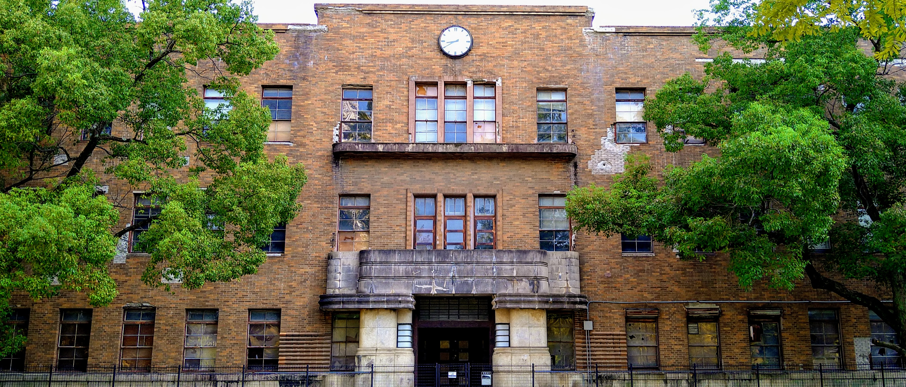
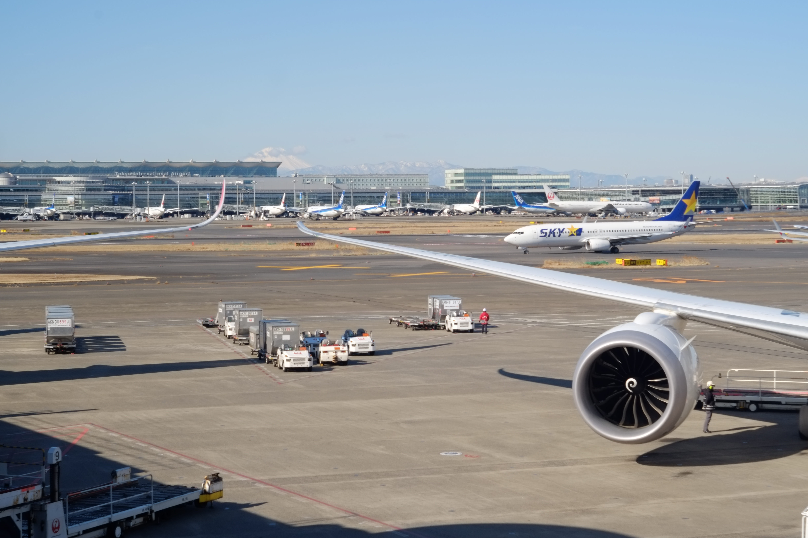
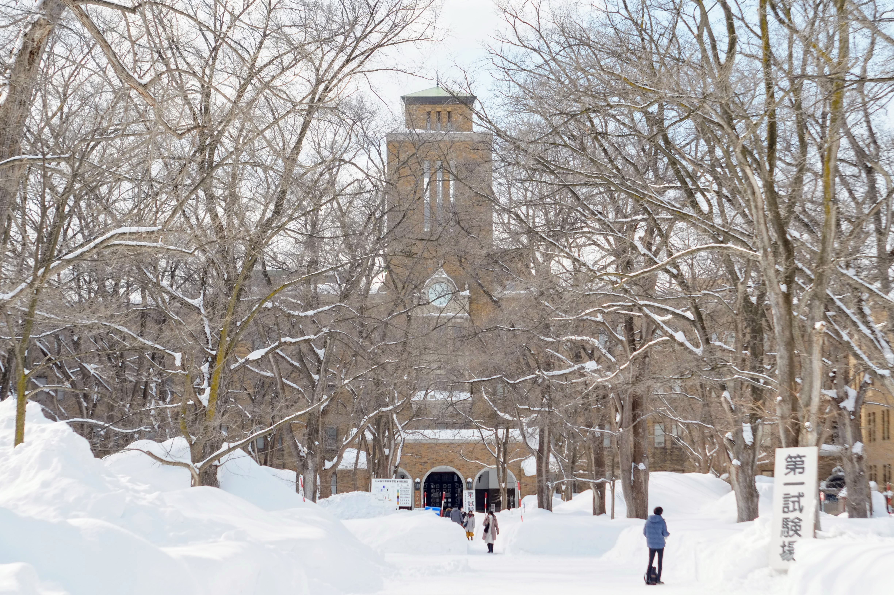
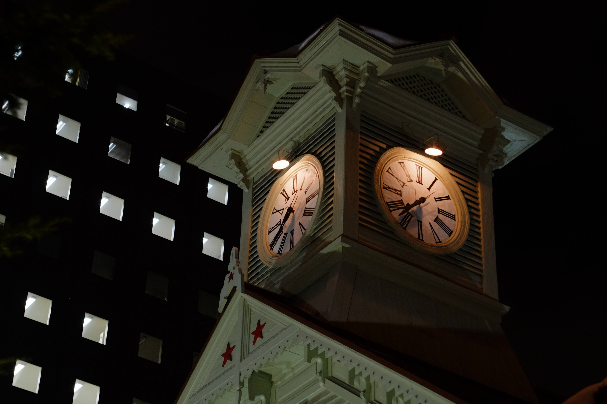
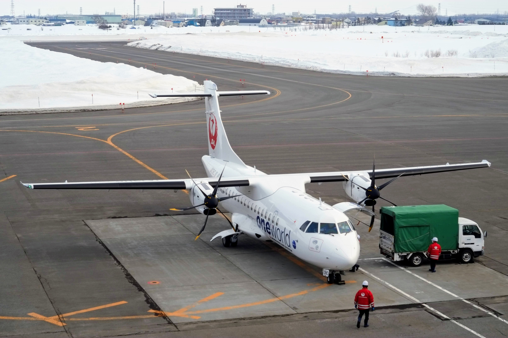
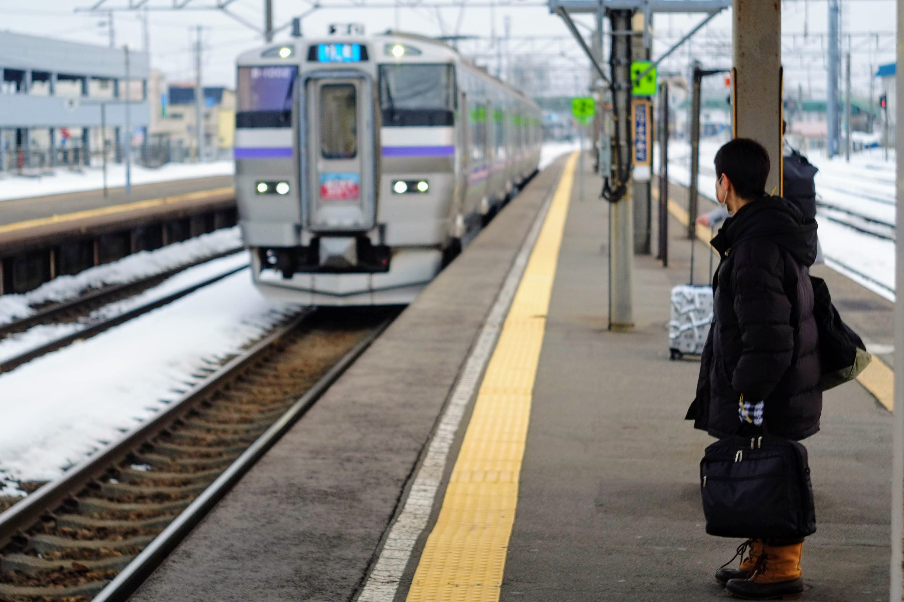
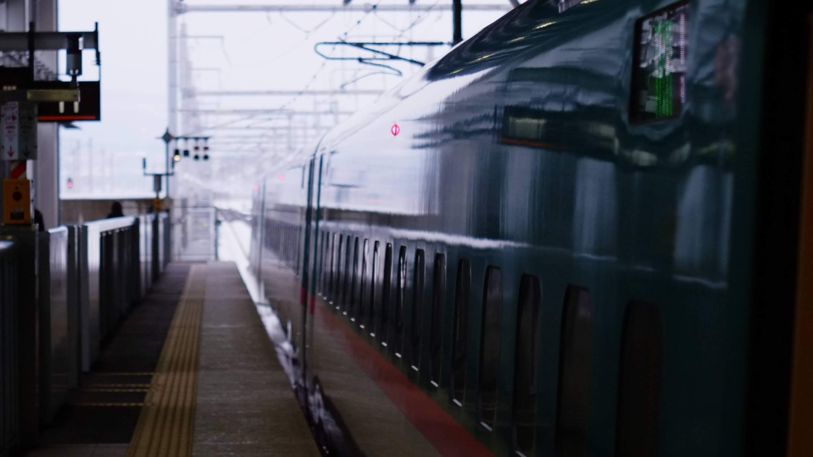

import Video from '../../../../components/Video.astro';
import video1 from './_1.mp4';
import video2 from './_2.mp4';

2021年度は個人的に色々あったのでその記録.
札幌紀行の写真だけを見たい場合は目次から飛んでください.

## 目次

- [目次](#目次)
- [2021年度振り返り](#2021年度振り返り)
  - [3月: 高校卒業・海自入隊](#3月-高校卒業海自入隊)
  - [4月~9月: 横須賀教育隊](#4月9月-横須賀教育隊)
  - [9月~11月: 呉転勤・退職](#9月11月-呉転勤退職)
  - [12月~1月: 受験勉強・ActivityPubへの移行・共通テスト](#12月1月-受験勉強activitypubへの移行共通テスト)
  - [2月: 2次試験・北大受験](#2月-2次試験北大受験)
  - [3月: 合否発表](#3月-合否発表)
- [札幌紀行](#札幌紀行)
  - [往路](#往路)
  - [札幌](#札幌)
  - [復路](#復路)

## 2021年度振り返り

どこまで書いていいのかわからないので簡単に.
誰かの参考になれば嬉しい[^1].
[^1]: 参考したい人がこのブログに辿り着くのか?

### 3月: 高校卒業・海自入隊

就職活動を2020年中に終わらせ,
[やり残してたこと](/blog/electronics/solar-tracker/)などやりつつ
入隊の準備をした.
月末にバスで横須賀に移動,
翌月初めに入隊 (任期付の下っ端).
母校の進学実績に「就職」の項目を作り出した[^2].

[^2]: [令和3（2021）年度　進路状況](http://www.gakugei-hs.setagaya.tokyo.jp/wp/wp-content/uploads/2021/05/620f688e9590aa4bd7c95cb5a236dc5b.pdf)

持ち物について,
持って行って良かったものは,
**呉556**, **エアーサロンパス**,
高性能な**ランニングシューズ**と登山用**インソール**[^3],
ドライバーなどの**工具類**,
**マグネットフック**.
特にマグネットフックは過剰量でも構わない.
余っても同期に渡して会話のタネにもなる.
逆に持って行かなくて良いと思ったのは,
大量の私服, 靴下, 白パンツ[^4]とか.
ただし, 物資の余剰は心の余裕にもなるので多めを心掛けると良い.

書籍の持ち込みは分隊の方針にもよるだろうが,
私の分隊では許されてた.
私のロッカー内には語学・物理専門書コーナーが出来上がっていた.

[^3]: 登山用インソールは半長靴 (陸兵さんが履くブーツ) にいれる.
ただし, 隣の陸自武山駐屯地内のファミマで陸自御用達のインソールが買えるので
そちらを購入するのもあり.
私はゲル状のインソールを普段使いの革靴に入れていた.
[^4]: 無彩色のパンツなら夏服でも許された. 灰色がおすすめ.

### 4月~9月: 横須賀教育隊

新兵教育を受けた.
訓練内容はネットで調べれば沢山でてくる.
運動能力は自信無かったが, 赤帽・赤靴どちらもお世話にならなかった.
「運動できなくともなんとかなる」とネットで書いてあったが,
多少はできた方が楽である.
できないということはできるまで訓練があるということだから.
最低限, 平泳ぎは泳げるようにはしておきたい.

2021年はCOVID-19が流行しており,
外出範囲は県内だったり市内だったりと狭かった.
流行が落ち着いた頃に鎌倉に行ったが,
鎌倉は観光地として言うまでもなく素晴しい.
ただ, 日用品の購入には苦労するので,
そういったものは横須賀中央で調達するのが良い.

私は休日に三浦半島の温泉を巡った. 以下はその感想.

- [のぼり雲](http://www.noborigumo.jp/)  
教育隊(武山)に近く, 気楽に行ける.
人は多くなく静かに過ごせる.
また, 併設のレストランは雰囲気が良く,
風呂上がり, 窓際の席で三浦半島の山々を眺めながら食べる飯は格別.
なお, 露天は空しか見えない.

- [油壺温泉](https://www.misakikanko.co.jp/aburatsubo/index.html)  
油壺にある京急ホテル内の温泉.
人は少なく, 運が良いと貸切状態.
小網代湾を一望できる絶景の露天,
対岸に露頭が見えるので地層好きにはたまらないだろう.
レストランは良くも悪くもホテルのレストランといった感じ.
高い, 美味しい.

- [湯楽の里](https://www.yurakirari.com/yura/yokosuka/)  
馬堀海岸にある温泉.
東京湾を望める露天で有名だが,
それ以外の施設も綺麗.
レストランは前述の2湯に比べ安いが,
しっかり美味しい. 
特に限定メニューがずるい,
何度も行きたくなる(実際何度も行った).

専門書の購入については, 横須賀では苦労した.
横浜に出れば大きな書店があるが,
市内では汐入COASKA内のくまざわ書店,
中央駅モアーズシティ内の文教堂などしかなく,
専門書の品揃えは一長一短といった具合.
古本屋については聖徳寺坂下バス停前にある港文堂書店にのみ行った.
神保町を思わせる古式ゆかしい佇まいで,
三浦半島の古本を一挙に担っているかのような多岐にわたるラインナップである.
理解もできないのに彌永昌吉の本を買ったりした.

### 9月~11月: 呉転勤・退職

新兵教育は8月までで,
その後は各部隊に送り出される.
ただし私は某乗組員になるための呉の某教育訓練隊に行くことになった.
ちなみに私はこのあたりで退職・大学進学を決意した.

某教育課程の情報はネット上にあまり転がってないため,
ここでの記述も避ける.
母数が少ないからだとも思うが,
訓練内容がそのまま機密になるからだとも思う.
ここでも休日のことを書く.

呉の町は1日見てまわれるほどの観光地であるが,
1日で見おわってしまうので休日は勉強ばかりしていた.
外出範囲が拡がってからは竹原・広島に行った.

竹原は,
呉線を岡山の方にしばらく行ったところにある小さい町.
安芸の小京都と呼ばれただけあって,
町並み保存地区は歩いていて楽しい.
ただ, お好み焼き屋は昼時には混むので注意 (私は食べられなかった).
たまゆらの舞台巡りという目的は達成した.
呉線の車窓は言葉にならないほど綺麗だったのでまた乗りに行きたい.

<Video src={video1} loop />

広島は大きい街であるから退屈しなかった.
産業奨励館や広島城などを見てまわった後は,
久々の都会ということで家電量販店を巡り,
[final B2](https://final-inc.com/products/b2-jp) などを導入.
ずっと使ってたE3000と近い汎用性で重宝している.
また, 八丁堀にはジュンク堂書店があり, 入り浸った.
この街は専門書の購入に苦労しないと思う.

観光地としてはマイナーだが,
広島大学旧理学部1号館を探訪.
被爆建築であるが,
その後も広大理学部として1991年まで使われていた.
2021年現在は完全に放置状態.
広大にはかつて理論物理学研究所があり[^5],
前述の竹原市も併せて物理学に縁がある街である.
少ないがそういった展示も随所にみられるので,
それを目的に広島を訪れるのも悪くないと思う.

[^5]: [広大理論物理学研究所](https://ja.wikipedia.org/wiki/%E5%BA%83%E5%B3%B6%E6%96%87%E7%90%86%E7%A7%91%E5%A4%A7%E5%AD%A6#%E7%90%86%E8%AB%96%E7%89%A9%E7%90%86%E5%AD%A6%E7%A0%94%E7%A9%B6%E6%89%80).
1990年, 京都大学基礎物理学研究所に統合され廃止.

11月になり退職.
手続きは約2ヶ月かかったが,
前例を鑑みると早い方だと思われる.
訓練しか行わず退職してしまったことを申し訳なく思ってる.
その分, 学業なりで社会に貢献できたらと思う.

### 12月~1月: 受験勉強・ActivityPubへの移行・共通テスト

東京に帰ってきて宅浪.
ただ, ずっと家にこもってるとなんとも飽きてくるもので,
前々から建てようと思ってたMisskey鯖を本格的に建てた.
最初はConoHa VPS,
そしてVultr, Amazon Lightsailと安いVPSを転々とし,
最終的にはTLで教えてもらった[Contabo](https://contabo.com/en/)に収まった.
ただ, 慣れない鯖の引っ越しを繰り返した結果,
何回もトラブルを起こしてしまい,
年明けの瞬間に鯖のリセットをするという思い出を作り出してしまった.
おかげで雀の涙ほどのインフラ知識は得られたと思う.
最近はずっと[@xiupos@mk.xiupos.net](https://mk.xiupos.net/@xiupos)に引き込もっている.

そういえばドメインも買った(xiupos.net).
活用していきたい.

共通テストは話題になっていた通りの難化.
結果を書くのは気が進まないが,
自他の予想以上の点数だったことは確か.
2020年度も実は共テを受けていたが,
点数の水準は2年連続で同じくらいだった.

### 2月: 2次試験・北大受験

私立入試や国立前期試験など.
ここでようやく札幌紀行の話になる.
北大を選んだ理由は勉強しなくても受かりそうだったから.

札幌出発直前にレンズ**Industar-61 L/D 55mm f/2.8**を購入.
前に使ってたニッコールは筐体が大きく重く,
持ち運ぶには苦労していた.
61は中々コンパクトで写りも申し分ないため,
今後メインに使っていきたい[^6].
気付けばX-E1も発売から10年経っている.

[^6]: まだ慣れていないためピントはあまあま.

### 3月: 合否発表

北大受かってました.
今年は春から札幌.

---

## 札幌紀行

北海道大学という大学は札幌にあるので,
受験するには札幌に行く必要がある.
東京からは空路で新千歳に行きエアポート快速で札幌に行くのが定番であるが,
今年は大雪によってそのルートが塞がれていた[^7].
私は出発前夜に予定を変更しなんとか札幌に到着した.
[^7]: [「こういうのも含めて受験かな…」JR運休で新千歳空港に一時3000人以上が足止め…受験生の姿多く - HTB](https://web.archive.org/web/20220223234528/https://www.htb.co.jp/news/archives_15023.html)

### 往路

羽田空港から旭川空港までJAL便で移動,
特急カムイで札幌に入った.

飛行機は久し振り,
しかも家族や教員も無しで乗るのは初めてだったので,
離陸のときに年甲斐もなく緊張.
しかし2時間くらいで着陸体制,
タイまでの飛行機に比べればあっという間に北海道の地に辿り着いた.

旭川から札幌までの移動が問題で,
旭川駅に到着した時点で函館本線は運休.
電光掲示板にはカムイ30号の文字こそあれど,
放送は繰り返し除雪遅延を伝えていた.
余裕をもって予約していたが運行情報が気になり,
昼食は駅施設内のコンビニで済ませ,
裏の忠別川を見たり入場券でホームに上がったりなど
駅近辺で過ごした.
そして, 発車時間の30分ほど前になって除雪完了のアナウンス,
カムイ30号から運行が再開した.
よくこんなで再開できたものだと思う.
雪国の洗礼を受けた.

<Video src={video2} loop />

予定時間より数分遅れだが札幌に到着.
新千歳から札幌までの鉄路が復旧したのが
翌朝であることを考えると,
旭川経由にしたのは大成功だった.
旭川を提案してくれた北大生の友人には頭が上がらない.
余裕をもってホテルに入り, のんびり過ごす.

### 札幌

前日くらいは勉強しないとさすがにまずいと思い,
ホテルにこもって勉強.
昼は一蘭に行き, ついでに会場の下見.
雪は積もっていたが想像よりは歩き辛くない.
構内のアイヌ語表記の看板などみて興奮していた.
夜はやき弁[^8]を食べ, 早めに就寝.
[^8]: そういえば夏に横教のヤマザキショップでやき弁フェアをやっていた.
「北海道で食べなきゃ意味ない!!」と見栄を張って買わなかったが,
まさか半年後に実現するとは.

試験当日は上の写真の建物に入って, 試験を受けたら, 試験が終わってた.
試験後は北大生の友人と会い札幌を散歩.
地下街と地上を行ったり来たりしていたら
完全に方向感覚を失った.
条里制恐るべし.

### 復路

この日は朝から新千歳空港も運行していたが,
受験生の予約が一杯で断念.
札幌丘珠空港から函館空港までJAL便,
新函館北斗駅から新幹線で帰った.

この便もほぼ満席で,
最前列反対向きといういかにも余りもの席になった.
人生初プロペラ機で,
そのプロペラを常に正面から眺められたのは良かったかもしれない.

函館ではラッキーピエロを食しただけで,
観光という観光はしなかった.
新函館北斗駅に移動する際に,
1本前の電車に乗ってしまったために
五稜郭駅で乗り換え待ち.

特別に駅舎内に入れていただいたが,
小一時間待つことになったので
乗り換え案内には従うべきであった.

新函館北斗駅で北海道新幹線に乗り換え北海道を後にした.

