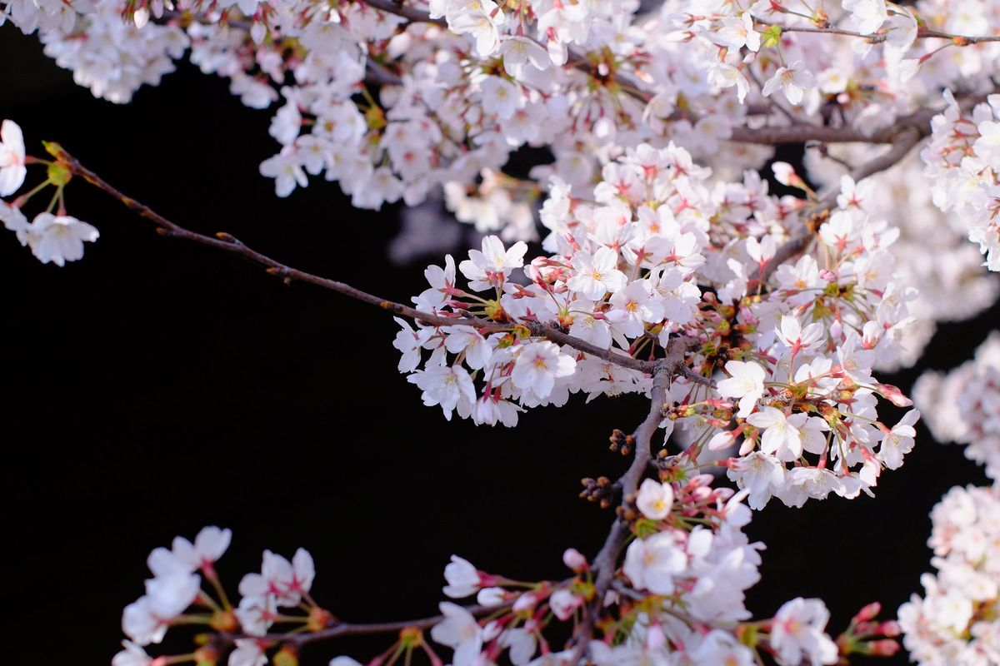
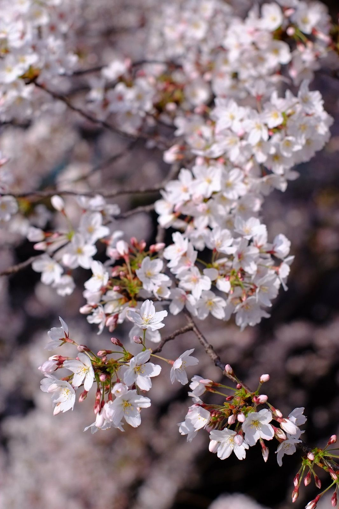
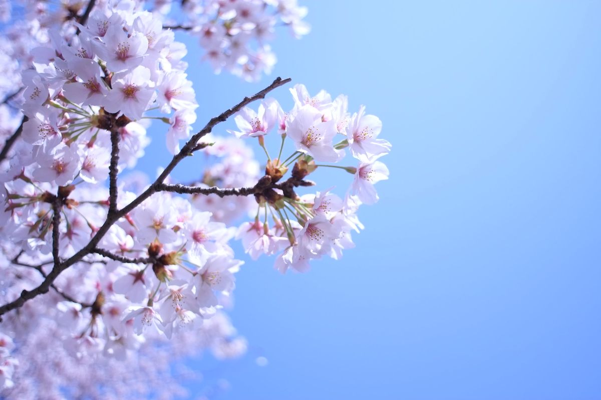

忙しかった去年に比べ, 今年は時間があったので近所の桜を見てきた.
平日の朝8時くらいに行くと, まだ人が少ないのでおすすめ.

ついでに, [このあいだ買ったX-E1](/blog/camera/x-e1/)の練習をしてきた. マニュアルフォーカス難しい!
以下, 奇跡的にピントが合った数少ない写真たち.

本当は桜並木とか全体も撮っていたが, ピントがずれまくりだった.
あゝ難しい難しい.
けど, ピントが合った写真があると結構感動.
マニュアルレンズでないとわからない感動...?
もっと写真を撮らなくては.
