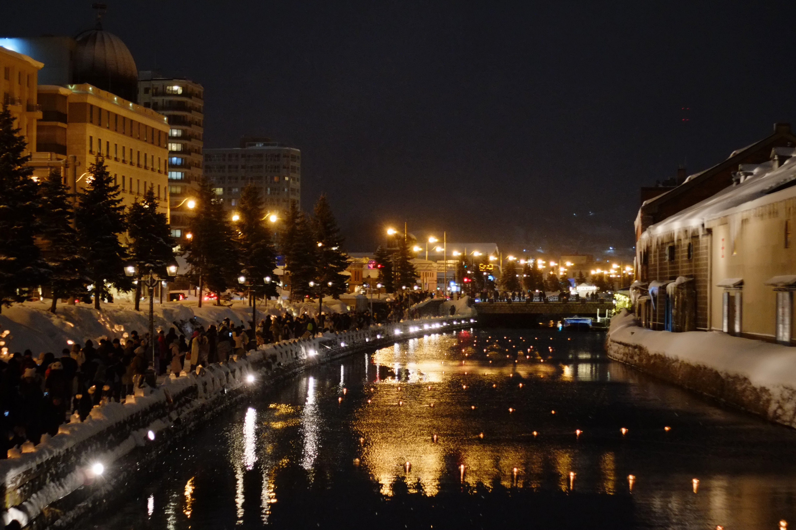
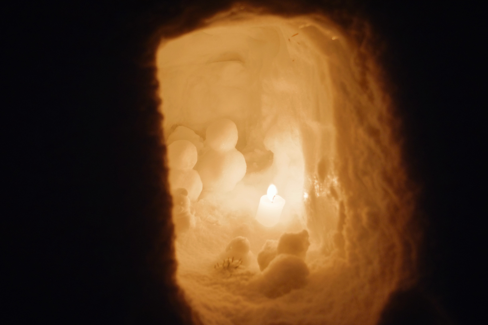
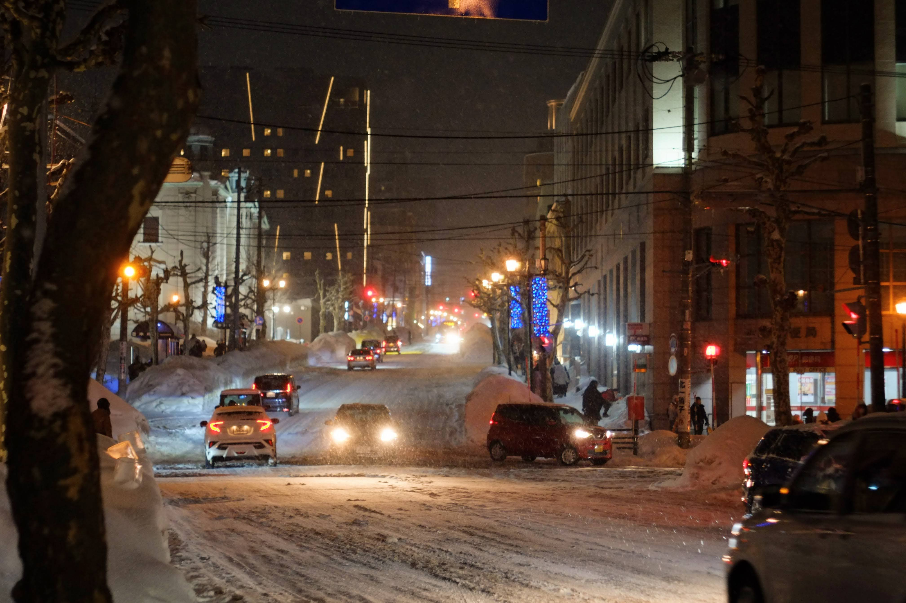

先週, 本州から友人が遊びに来たので, 一緒に[小樽雪あかりの路](http://yukiakarinomichi.org/)へ行った. その際に久々にカメラを持ち出したので何枚か載せる. 旅行写真の記事は久々であるように思う.

まだ [X-E1](/blog/camera/x-e1/) + [И-61Л/Д](/blog/camera/2021/#2%E6%9C%88-2%E6%AC%A1%E8%A9%A6%E9%A8%93%E5%8C%97%E5%A4%A7%E5%8F%97%E9%A8%93) の構成でやっている. もう7年もマニュアルフォーカスで生きているが, 未だにピントの合っている写真は少ない. 観光客が多く, 落ち着いてカメラを構える余裕が無かった, という言い訳もしたくなる[^1].

[^1]: 実際に観光客は多かった. 1枚目の写真, 川沿いの黒い影はすべて人間である.

せっかく観光地として名高い札幌に住んでいるのだから, もっと普段から各地を周りたいのに, 適当な理由をつけて出不精になってしまっている. 3年目ともなればこんなものか.

