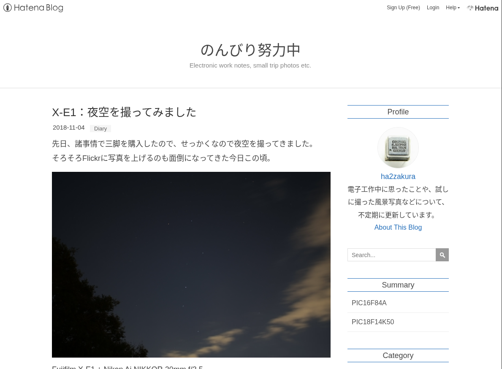
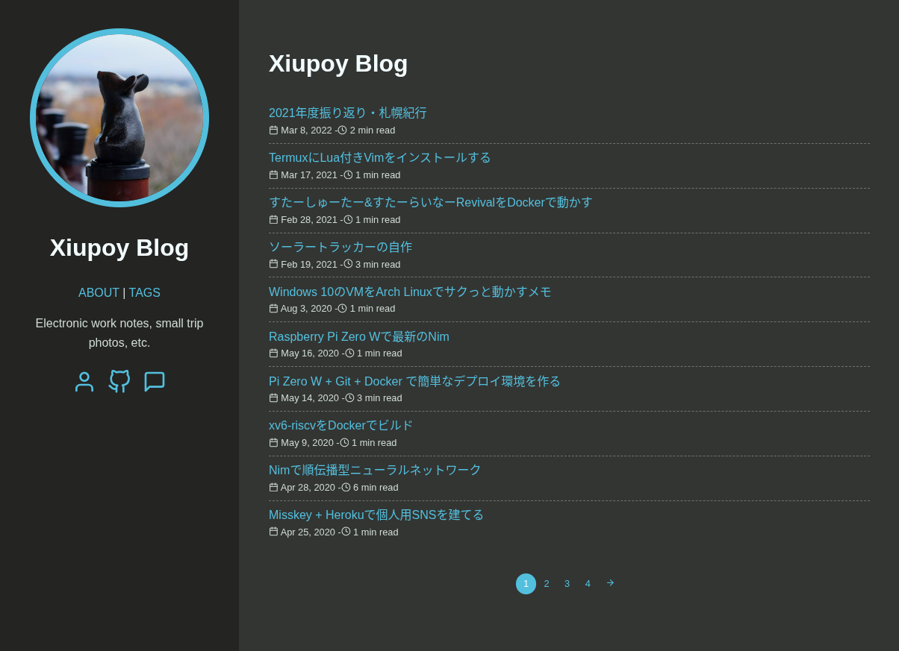
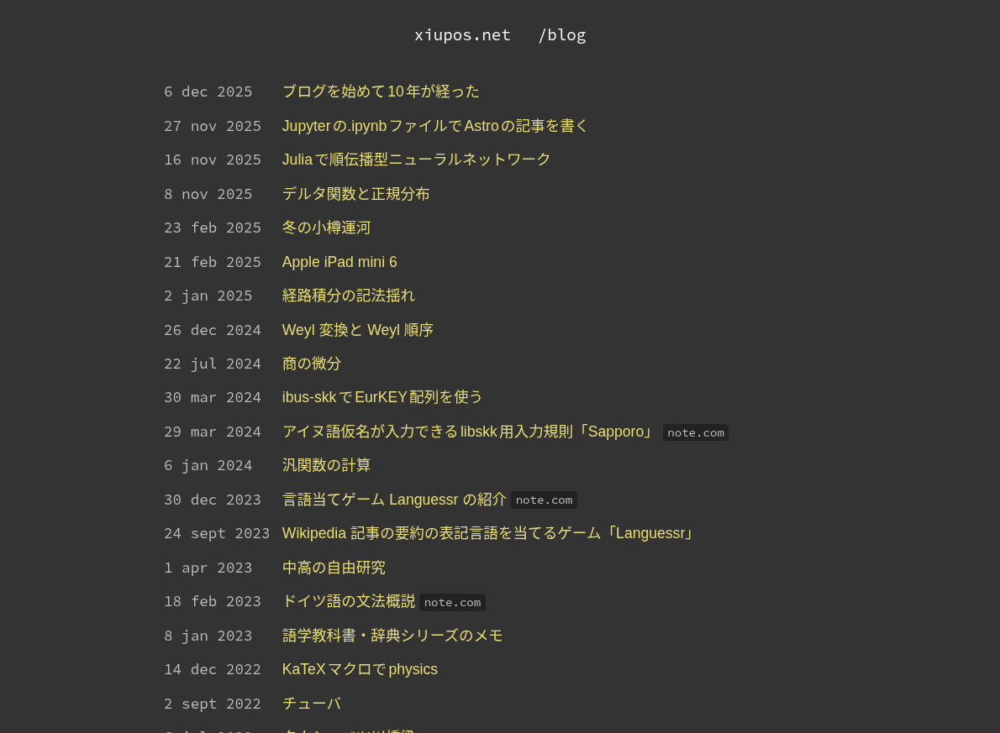

:::adcal

この記事は「[Fediverse (3) Advent Calendar 2025](https://adventar.org/calendars/12280)」6日目および「[北大IT研究会 HUIT Advent Calendar 2025](https://adventar.org/calendars/11772)」6日目の記事です.

:::

このブログを始めて10年[^10]が経った. 名義を変えたり, ブログタイトルを変えたりしながらも, 一応は連続的に続いた. いい機会なので, 10年間のブログでの思い出を文章化してみる. アドカレに自分語りなポエムを追加することを許してください.

[^10]: 執筆時点で10年10ヶ月なので, どちらかというと11年の方が近い. 遅刻しました.

### 目次

1. [PHP + HTML (2015/2 ~ 2015/3)](#php--html-20152--20153)
1. [WordPress (2015/3 ~ 2015/5)](#wordpress-20153--20155)
1. [livedoor ブログ (2015/5 ~ 2017/9)](#livedoor-ブログ-20155--20179)
1. [はてなブログ (2017/9 ~ 2020/4)](#はてなブログ-20179--20204)
1. [Hugo (2020/4 ~ 2023/4)](#hugo-20204--20234)
1. [Astro (2023/4 ~)](#astro-20234)

## PHP + HTML (2015/2 ~ 2015/3)

中学受験が終わって一息ついた小学6年生の2月に, このブログを始めた. 最初は適当に見つけてきた HTML テンプレートを無料レンタルサーバー[^webcrow]でホストしただけの簡素なものであったが, [Bootstrap](https://getbootstrap.com/) で記事一覧の見た目を整えたり, PHP で記事本文以外のパーツを共通化してみたりと, 自分なりに「ブログ」の体裁に近付けようとしていた.

[^webcrow]: [ウェブクロウ](https://web.archive.org/web/20150201052857/http://www.webcrow.jp/)というネットオウル(現スターサーバー)の無料レンタルサーバーを使っていた. 次の WordPress も同じ系列の[WPblog](https://web.archive.org/web/20150423035508/http://www.wpblog.jp/)という無料ホスティングサービスである. 2025年時点ではどちらもサービス終了している.

具体的な記事の記録は残っていなかった. たしか「ブログはじめました」というタイトルで, レンタルサーバーへの HTML テンプレートのアップロード方法か何かを書いた覚えがある. 自己紹介なども律儀に書いていて, 実は今よりもブログっぽかったのかもしれない.

そもそもどうしてブログを始めたか, これもよく覚えていない. ただ, 幼少期の時点で既にネットが普及していたのと, 電子工作少年であったことから, 情報源としての個人ブログの存在はかなり身近なものであったし, それらを読みながら見よう見まねで電子工作していたのだから, 自分もブログで情報発信をしたいと思ったのは自然な発想だろう. 加えて, クラスで流行りの言葉を載せたHTMLを学校のPC室で表示したり, [デュラララ!!](https://www.durarara.com/1st/) に影響されて仲間内のチャットサイト[^chat]を作ったりしていたので, それらの「工作」の一環としてブログも作ってみようとしたのだと思う.

[^chat]: ネットで拾った PHP + Ajax 構成の掲示板のコードを元に, デザインをデュラララ!!のチャット風にしたり. リアルタイム性を求めてバックエンドに [Firebase](https://firebase.google.com/) を使ったりと, 小学生なりに改良して使っていた. 中学に進学して友人たちと離れたあともしばらく使われており, まだ LINE がそこまで普及していなかったこともあって, 貴重な連絡手段にもなっていた.

ちなみに, しばらく自己紹介に「文章力を上げるためのブログ」と書いていたが, ご覧の通り, 10年続けてもまるで効果はなかった.

## WordPress (2015/3 ~ 2015/5)

素の HTML で記事を書くのに耐えられず, 1ヶ月で [WordPress](https://wordpress.org/) に移行した. ようやく積極的に記事を書くようになったが, いかんせん幼いので「〇〇を買った。これから色々遊んで記事にしたい」(以後それに関する記事は無し) のような記事ばかりだった覚えがある.

WP を使っていたのはたった2ヶ月間であるが, 次の livedoor ブログに記事を引き継いだので, 本格的にブログが始動したのはこの時期と言っていいだろう.

## livedoor ブログ (2015/5 ~ 2017/9)

5月に「[livedoor ブログ](https://blog.livedoor.com/)が完全無料化した」という[ニュース](https://staff.livedoor.blog/archives/51881996.html)を見て, 馬鹿な中坊であった自分は釣られて登録してしまった. livedoor ブログは商業的なブログサービスであるから, ウェブサイトとしては WP と比べて格段に不自由である. しかし, 元々 WP の自由度を活かせるほどの技術力を持ち合わせていなかったので, 当時の自分はむしろ「ブログ」らしいサイトになって喜んでいた.

この頃は月1くらいの頻度で記事を書いていた. 特に印象に残っているのは, 情報が少ないソフトウェアのインストール方法を書いた記事である. ある掲示板にてそれを読んでインストールできたという報告があって, 自分の記事が誰かの参考になったことがとても嬉しかった[^sanko]. また, [中学校の自由研究](../../electronics/hs-summer/index.md)でマイコンに触れる機会が増えたのもあって, 記事のネタはそれなりにあった.

[^sanko]: 以後も度々そういった機会があって, その都度喜んでいる. 元々は自己満足なブログであるが, 飽き性な自分が10年も続けられたのは, 自分もお世話になった個人ブログ文化への貢献の気持ちが大きい.

## はてなブログ (2017/9 ~ 2020/4)

高校受験を前に[^juken], 前々から livedoor ブログのスマホでの表示に不満があったのも重なって, 同じようなブログサービスである[はてなブログ](https://hatena.blog/)に移行した. また, livedoor ブログよりは自由度が増えて, この頃からサイトデザインにもこだわり始めるようになった.

[^juken]: こう思い返してみると, 受験の直前ほど新しいことに挑戦する傾向にあるらしい. ヒヤヒヤする.

画像は2018年頃のサイトトップである. ブログタイトルも名義も今とは違っている. またこの頃はタグ・カテゴリーや検索機能があって, 今より閲覧者に寄り添ったブログであったと言えよう.

この時期以降に書いた記事は, ほとんどが今のブログにまで引き継がれている (例えば上の画像中の記事は[これ](../../camera/night-sky/index.md)). 逆に言えば, livedoor ブログ以前の記事はしばらく経ってから消してしまった. 小中学生が書いた稚拙な記事だったとは言え, どこかに残しておいてもよかったと後悔している.

## Hugo (2020/4 ~ 2023/4)

コロナ禍で時間ができて, 前年末に [GitHub Actions](https://github.co.jp/features/actions) も登場したことから, これまでの商業的なブログサービスをやめて, [SSG](https://ja.wikipedia.org/wiki/%E9%9D%99%E7%9A%84%E3%82%B5%E3%82%A4%E3%83%88%E3%82%B8%E3%82%A7%E3%83%8D%E3%83%AC%E3%83%BC%E3%82%BF%E3%83%BC) を使うことを決意した. 5年前よりもモダンな技術力を身に付け, セルフホストによるブログ自作へと回帰した形である.

画像は2022年頃のサイトトップであり, この頃には名義もブログタイトルも現在のものに落ち着いた. サイト自体は [Hugo](https://gohugo.io/) を用いて作成されており, テーマは自作せず [vaga/hugo-theme-m10c](https://github.com/vaga/hugo-theme-m10c) を使っていた. それでも自由度は格段に上がっており, 例えば $\TeX$ 数式などが使えるようになって記事の幅も拡がった. 一方, ブログとしての機能性については「タグ・カテゴリは廃止」「検索はいらない」とミニマルな志向になっていき, また記事本文の敬体を常体に改めたことで, いよいよ閲覧者に気を使わないブログになってしまった.

## Astro (2023/4 ~)

3年間 Hugo を使っていたが, 大学2年生で学部に移行して時間に余裕ができ, 常々やりたいと思っていた「一からテーマ自作」を行動に移した. ついでに Fediverse の友人に教えてもらった [Astro](https://astro.build/) でブログ全体を作り直した.

画像は執筆時点 (2025年12月) でのブログのトップである. 投稿年月日とタイトルだけを羅列した目次は, ミニマルを目指したからなのか, 実装が面倒だったからなのか. どちらにしろ, 年数の割に記事の少ないこのブログには十分な機能性だと思っている. 個性と言い張る勇気!

またこの頃からブログが自分にとって新しい役割を持ち始めた. 記事としては公開されない, Markdown と $\TeX$ 数式による「ノート」としての役割である. 書いたものは他のブログ記事と同じようにスマホからでも確認できて, [Pandoc](https://pandoc.org/) 等を使えばそれらを $\LaTeX$ 文章に変えることも容易であることから, 数学と物理学に関する勉強ノートを (ブログ記事としては下書き[^draft]扱いで) 同列に管理するようになった. 2年半で30本以上のノートを作成しており, このブログは「生活インフラ」の一部になりつつある.

[^draft]: 下書きはブログトップの目次には並ばず, 検索エンジンにも `noindex` を返しているが, ブログの[ソースコード](https://github.com/xiupos/xiupos)を探せばそれらの下書きを見ることもできる. またノートのいくつかは記事として公開している ([Weyl 順序](https://xiupos.net/blog/note/weyl-transform)など).

---

以上が10年間の思い出である.

振り返ってみると, 記事を書くのはもちろんだが, ブログ自体にもこだわって移転や改良を繰り返してきた. 話はずれるが, 最近[ミンゲイインターネット(mingeiinter.net)](https://mingeiinter.net/)というサイトの存在を知った. つまりはセルフホストによる個人ブログのリンク集であるが, 「インターネット上にある 民藝 のような良さ」を『ミンゲイ』と呼んでいて (c.f. [民藝運動](https://www.nihon-mingeikyoukai.jp/about/)), 強く感銘を受けた. Fediverse における友人たちの個人ブログも既に追加されており, 自薦という形で畏れ多くも末席に加えていただいた.

このブログは今後も続けていくつもりだし, またキリのいい周年でこういった振り返り記事を書きたい. 続くといいな.
