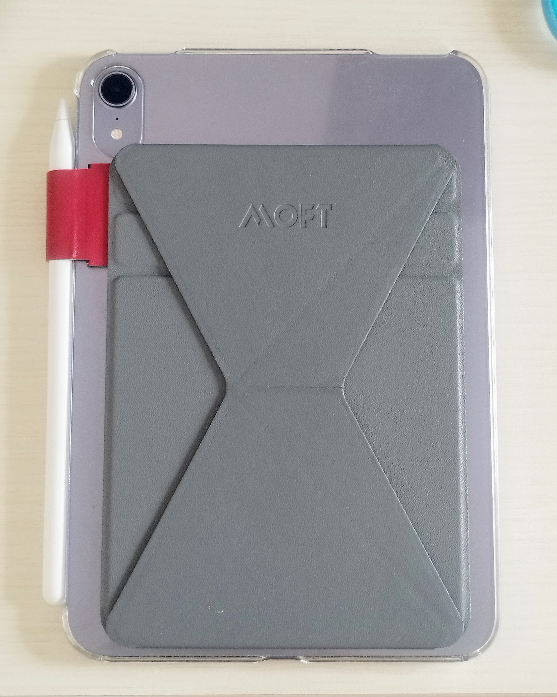

昨年の7月に Apple の iPad mini 6 を買った. 近所の中古PCショップで6万4千円. 同サイズ帯のタブレットとしては高いが, iPhone を買うよりは断然安い.

当初は電子書籍リーダーとして小型タブレットを検討していたが, 長期的なOSアップデートを期待し, 一念発起して Apple 製品にした. 大学経由の電子書籍やレビューなどを気軽に読むようになったため, 結果的には元を取れていると思う.

特にペンの使い勝手が良い. 上の写真にあるペンは純正ではない格安ペンで, 筆圧感知やファンクションボタンが無い. それでも本体横に磁気でくっ付ければ充電されるし, ペンの精度は Android タブレットの比じゃないため, 十分に便利である[^pen].

[^pen]: 純正ペンは, それだけで安い Android タブレットが買えるほどの値段であって, それを持ち歩く度胸は私には無い.

ただ, 半年ほど使っているが, まだ Linux ラップトップや Android スマホとの連携の最適解を見付けられていない. Apple 社による「囲い込み」を常々感じている.
