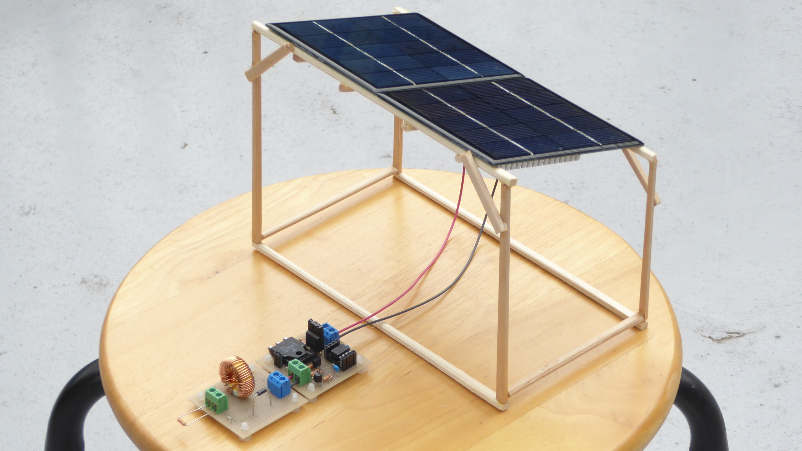
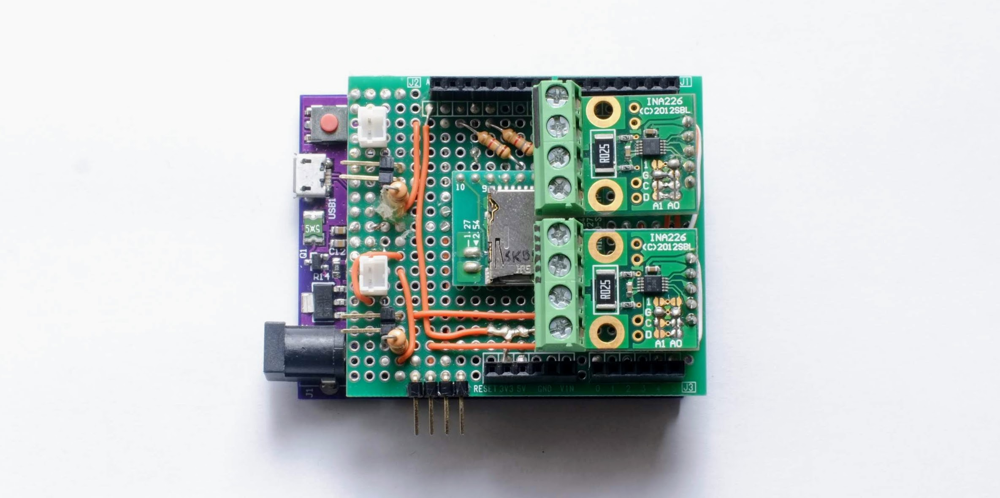
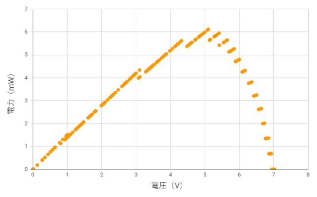
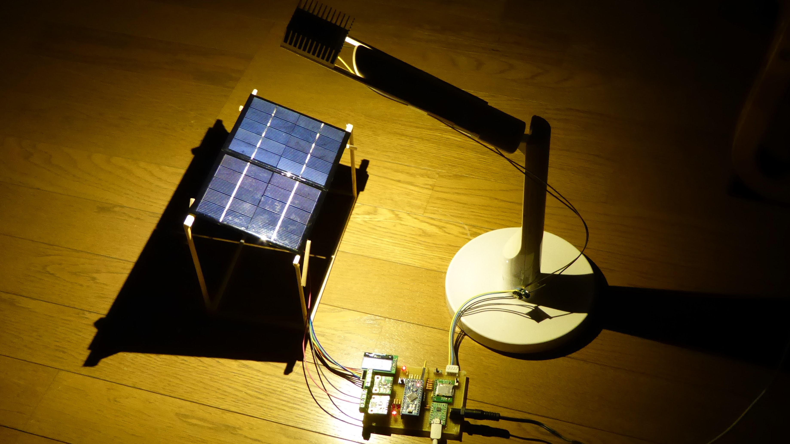
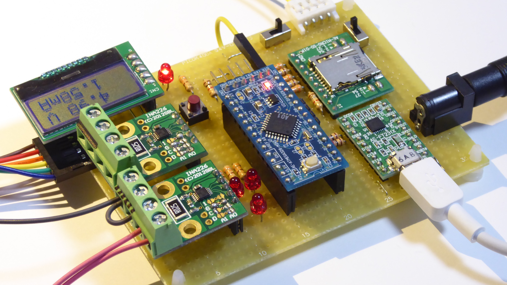
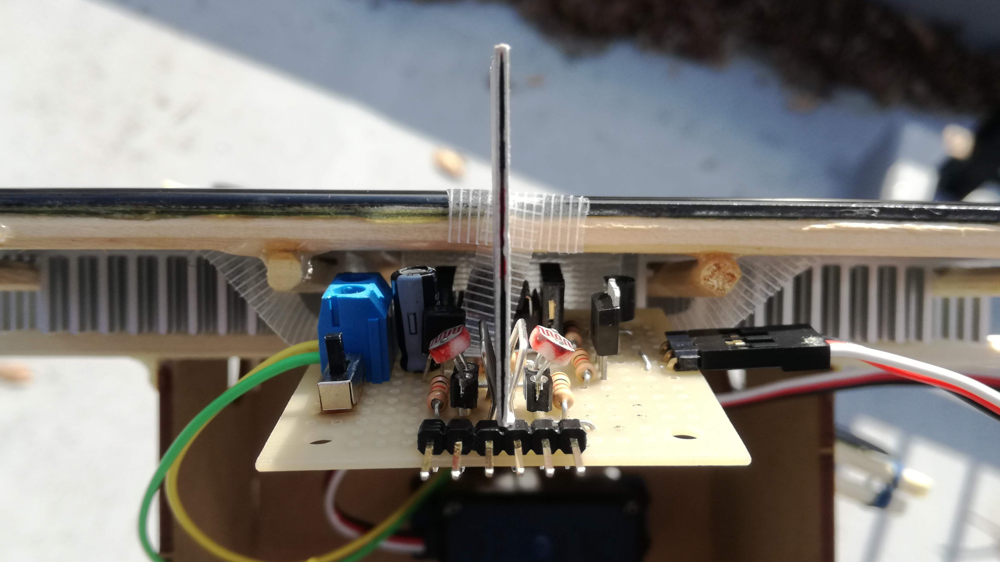
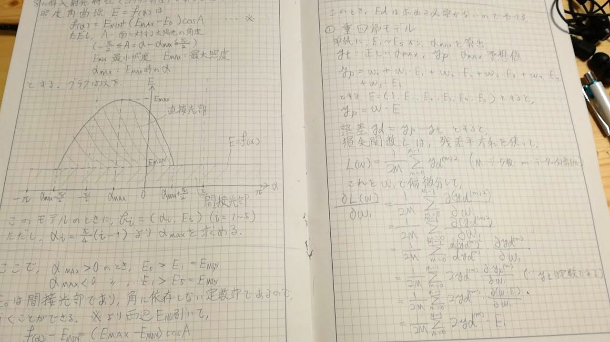
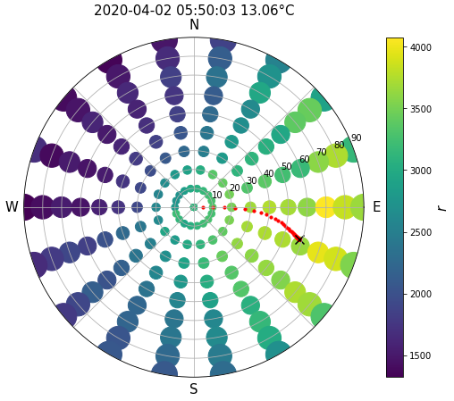

通っていた中学校と高校は「教育実験校」で,
夏から秋にかけて自由研究をやらされていた.
それも,「やっておわり」で済まされず,
レポート, ポスター, スライドで発表させられるなど,
スパルタ中学校・高校である.
卒業してから既に年月が経っているが,
GDriveの「その他」ディレクトリからそれらのデータを発掘したので,
思い出がてらまとめてみる[^1].
研究とは言えない程度のものではあるが,
母校の後輩なり,
たまたま辿り着いた人なりの参考になれば嬉しい.

[^1]: ネットの情報のおかげで完成した研究なのだから,
ネットに放流するのが正しい供養だろう.

- [一貫したテーマ](#一貫したテーマ)
- [中学1年](#中学1年)
- [中学2年](#中学2年)
- [中学3年](#中学3年)
- [高校1年](#高校1年)
- [高校2年](#高校2年)
- [高校3年](#高校3年)

## 一貫したテーマ

> 太陽電池の発電効率を上げるには

中1の春に適当に決めたテーマが6年間続いた.
目的はそのまんま.
「傘の内側にアルミホイル貼って光集めれば発電量上がる」という単純な結びを予感していた.

## 中学1年

前述のテーマについて素直に研究した.

「地面と水平に置く」
「南中高度に傾ける」
「アルミホイル傘に付ける」
という3つの状態のうち,
2つずつを比較するというのが研究手法である.
結果, 「南中高度に傾ける」が一番効率が上がった.
アルミホイル傘は確かに発電量が上がったが,
時間が経って太陽が傾くとむしろ発電量が下がった.
入射角によってパラボラの焦点がずれるからである.
今思うと, この予想外の結果への驚きが,
翌年以降の研究への原動力となった.

結果とは直接は関係無いが,
実験のために装置を作った.
ArduinoシールドにSDカードスロットと電圧電流センサ,
温度センサ, 負荷抵抗, 照度センサを積んでいる.
このとき載せた温度センサ, 負荷抵抗, 照度センサが,
それぞれ中学2年, 中学3年, 高校での研究に発展していく.

計測機器は毎回の研究で何かしら作っており,
年を経るごとにより高度になっていく.
それをまとめるのもこの記事の目的の一つである.

## 中学2年

テーマは「太陽電池と表面温度」である.
温度は前年の研究では参考程度に記録していたが,
温度と発電量を比べたとき,
同じ照度でも温度が高いと発電量が低くなっていた[^2].
この年の研究では, まずこの特性を再確認した上で,
太陽電池の表面温度を下げる手法について研究した.

[^2]: 太陽電池の温度特性を考えると当然のことである.

「何もしない」「ヒートシンク」「放熱ファン」「ペルチェ素子」
など比較して, 「ヒートシンク」が一番現実的であると結んだ.
うしろの2つは電力収支がむしろマイナスになるというのが理由である.
ここら辺の結びは中学生らしい安直なものであるが仕方ない[^3].

[^3]: 今おなじことを研究しても, おなじように結ぶかもしれない.

実験装置はより洗練された.
機能によって基板を分け,
ケーブルによってそれらを接続する.
この形式は将来的な流用を踏まえた設計である.
ちなみに流用はしなかった.

## 中学3年

テーマは「太陽電池と負荷」である.
中学1年の研究で, 発電された電力を計測するために負荷抵抗を付けていたのだが,
負荷抵抗によって電力が一定にならないことに気付いた.
以下は実際の計測結果であるが,
負荷抵抗が大き過ぎても小さすぎても駄目で,
太陽電池の発電能力を最大限引き出すためには負荷を制御しなければいけない.

この制御は一般には「最大電力点追従制御(MPPT)」と呼ばれている.
中学3年の研究ではMPPT装置の製作が目的であった.
まず, 室内実験で上の曲線を様々な明るさのときに計測した.

この実験から,
太陽電池の開放電圧に対して,
60~75%の電圧のときに最大点であることがわかった.
したがって,
製作するMPPT装置はこの電圧になるように制御すれば良いことになる.
そうして実際に製作されたのが,
この記事の[トップにある画像](#)の装置である.
中学3年にもなると開発の真似事も得意になってくるわけで,
[フローチャート](./_j3-3.png),
[回路構成図](./_j3-4.png),
[回路図](./_j3-5.png) [^4]
なんかも書いた.
制御には[PIC12LF1822](https://www.microchip.com/en-us/product/PIC12LF1822)という1.8V30μAの超低消費電力PICを使っている.
これが人生初PICマイコンとなった.

[^4]: 電圧検知回路が結線されていないのはご愛嬌.

この装置が上手くいったかというと,
実は結果は芳しくなく,
発電量が上がることも下がることもあった.
原因は「知識不足」と結んでいる, ずるい.
まあ中学生の背伸びにしては十二分のものであったというのが自他からの評価である.

さて, この年に製作した実験装置については,
極めて完成度の高いものであった.

と言っても, 市販のモジュールを組み合わせただけである.
ただ, Arduinoシールドからは卒業し,
一つの基板にきれいにまとめたあたりが特徴であろう.
この特徴はその後の電子工作へと継承されていく.
中学自由研究における実験装置の完成形と言って良いだろう.
ちなみに, 最後には実家の勉強机のデスクライトとして使われていた.

## 高校1年

高校における研究は2年から始まるのが普通であったが,
タイに行けると言われて1年のときから研究していた.
はじめは全く別の研究をするつもりでいたが形にならず,
渡航の数カ月前になってテーマを太陽電池に変えた.
そのため, この年だけは冬に研究をした.

テーマは「太陽電池を太陽の方向に向ける装置」,
つまりソーラートラッカーである.
中学1年のときの照度センサで, 値が大きければ発電量も多い,
というあたりまえの結果から考え出された間に合わせのテーマである.
検証する装置も既に決まっていた.

上の写真では見辛いが,
2つのCdSセルの間は厚紙で仕切られている.
また, この装置は太陽電池上部に取り付けられており,
これらをサーボモータで傾けることができる構造になっている.
要するに, 「明るい方へ傾ける装置」である.
制御には[PIC16F18313](https://www.microchip.com/en-us/product/PIC16F18313)を使った.

この装置の結末は単純で,
安定化させることができなかった[^5].
そもそも2つの値だけで検証すると,
極端な値に振り回されやすい.
今後の課題欄には「照度センサを増やして機械学習で太陽の位置を予想する」とか書いてお茶を濁した.

[^5]: [これは一般に失敗と言います](https://dic.nicovideo.jp/a/%E3%81%9D%E3%82%8C%E3%81%AF%E4%B8%80%E8%88%AC%E3%81%AB%E5%A4%B1%E6%95%97%E3%81%A8%E8%A8%80%E3%81%84%E3%81%BE%E3%81%99%E3%81%82%E3%82%8A%E3%81%8C%E3%81%A8%E3%81%86%E3%81%94%E3%81%96%E3%81%84%E3%81%BE%E3%81%99).

ちなみに, タイへは行くことはできなかった.
直前にインフルエンザに罹患した[^6].

[^6]: ついでに中音にも行けなかった.

## 高校2年

テーマは「照度センサを増やして機械学習で太陽の位置を予想する」である.
前年のお茶濁しを本当にやることにした.

この年はこれまでと違って装置を作っていない.
実のところ, この年の研究の骨子は1週間ほどで作られた.
夏に大阪で高校生の研究発表会があり,
2年生は見学者として参加できると聞いて応募した.
これが「見学者」ではなく「発表者」であったことが直前に判明したのである[^7].
そこから急いで機械学習の基礎を学び,
最低限発表できる形にまで押し進めた.
マイコンばかり触っていた小僧であるから,
はじめてのニューラルネットワークの実装はCだった.

[^7]: 弁明しておくと, 勘違いしていたのは弊校側の不手際である.
しかし, これまで何回か発表の場に立たされていたこともあり,
「君なら大丈夫だよね」と参加が強行された.
スパルタ高校である.
部活の合宿終了から大阪出発までの1週間に研究からポスター作成までした.

発表5日前の研究ノートの写真が残っていた.
荒唐無稽な内容が連なっているが,
今見ると後々の理論の芽が散見される.
太陽のある天球モデルを考え,
照度センサで得られるであろう値のセットを生成し,
それらを元データとして太陽の位置を求める学習をさせる.
この年の研究の結論としては, このモデルの妥当性に疑問符が付いた.

ちなみに, この年はタイへ行き発表することができた.
しかし, 日本人団のインフル罹患が訪問先で発覚し,
ホームステイ中止, スケジュール大幅変更など大変な騒ぎであった[^8].

[^8]: 私は罹患しなかったが, やけにインフルと縁があるイベントだった.

## 高校3年

高校2年の3月からコロナ休校になり, 研究に没頭することができた.
研究テーマは前年の継続で, 目先の課題は天球モデルの検証である.
まず, 現実世界の天球を観測することからはじまった.

照度センサを取り付けたヘッドを2軸のサーボモータによって動かして,
天球の様々な方向の照度を記録する.
制御には[ESP8266](/blog/esp8266/blink/)を使い,
GASで作られたデータ記録用APIを叩いてjson形式でGDriveに保存した[^9].
4月から8月まで,
雨の降っていない日の朝から晩まで自動で収集し[^10],
最終的には1017回分のデータが集まった.
下の写真, 制御回路をブレッドボードで済ましているのは,
コロナ禍で部品調達が思うようにできず,
手元にあった部品だけで構成したためである.

[^9]: 前年の高校文化祭のクラス会計で, GASを用いた自動処理を書いた経験が役立った.

[^10]: 書いていないが, これまでの研究でも測定は基本的に自動で行われていた.
基本的に学生の夏休みであるから,
日中ずっと実験しているわけにはいかないのである.

下の図は得られた一回分の結果をMatplotlibで簡単な図にしたものである.
こうして得られた結果から, 次は天球モデルを探る.
まず結果を眺め, 天気が晴れでも曇りでも,
ある方向が一番明るく, そこから反対の方向に向かって段々と暗くなっていくことがわかった.
この考察から, 前年の天球モデルを少し改良した.
そして, そのモデルが妥当であるかを検証するために,
各グラフの一番明るい方向をこの天球モデルの機械学習によって全て求めた.
下図には学習過程を示す赤点をプロットしてある.
そもそも明るい方向を求めるのが目的であるから,
機械学習によって求められた方向が最も明るい点と有意に近ければ目的達成となる.
そんな御託を並べ, 計算結果から, 天球モデルは妥当であると結んだ[^gotaku].

[^gotaku]: 学習と検証のセットを分けていないので, 有意に近くなるのはトートロジーである. 何も理解していないのがわかる

あたらしい天球モデルの良い点として,
ある特別なセンサー配置のときに解析的に天球モデルの解が求まる.
その解については[既に別の記事で解説している](/blog/electronics/solar-tracker/)ため割愛する.
モデルの理論も詳しく書いてある.
この解をもってこの年の研究は終わりとなった.
だいたい秋に終わり, 冬に大阪で最終発表をした[^11].
前年と同じイベントである.
稚拙な発表ではあったが,
熱心に話を聞いてくれた他校の1年生がいて,
なにか救われたような気がした.

[^11]: [私は受験生ではなかった](/blog/camera/2021/#3%E6%9C%88-%E9%AB%98%E6%A0%A1%E5%8D%92%E6%A5%AD%E6%B5%B7%E8%87%AA%E5%85%A5%E9%9A%8A).

