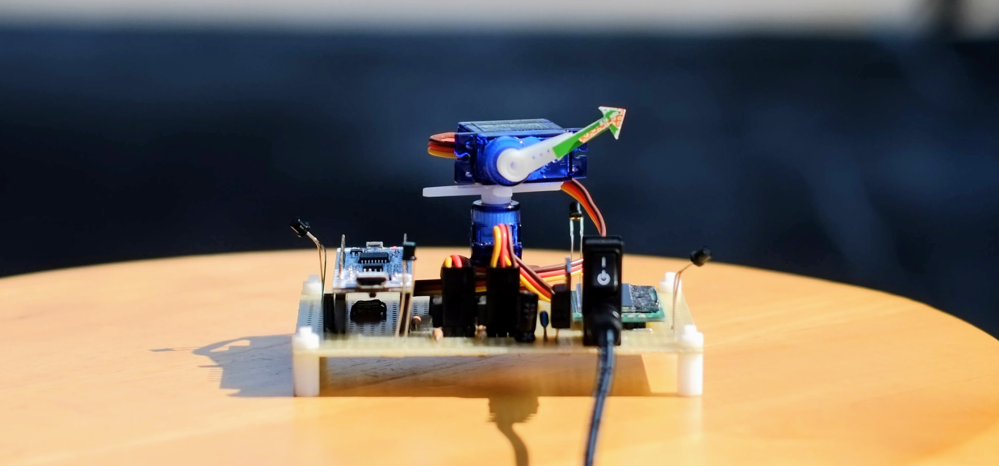
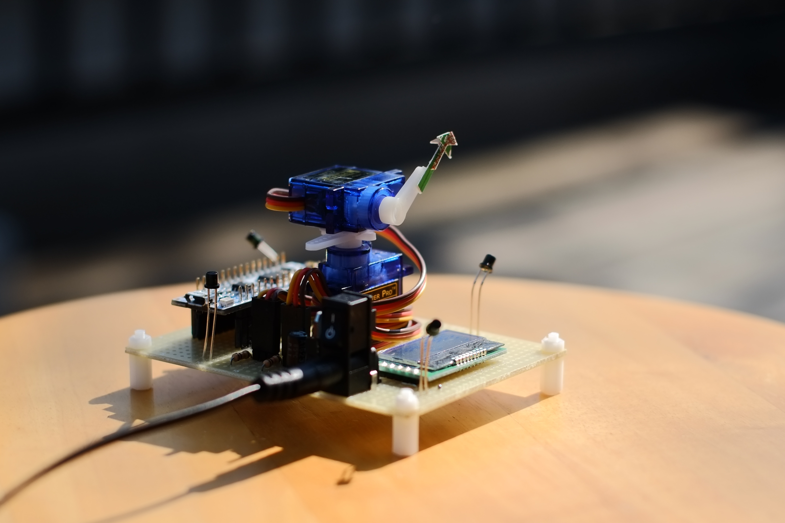

import Video from '@components/Video.astro';
import video1 from './_1.mp4';



最近の高校では「[総合的な探究の時間](https://www.mext.go.jp/content/1407196_21_1_1_2.pdf)」というものがある.
実施される内容は学校ごとに違うらしいが,
通っていた学校は教育実験校でもあったため,
探究とは研究の真似事をする時間だった.
そこで私がやった(似非)研究の要旨を,
情報としてまとめておく.
高校生が趣味の延長として探究した内容であるから,
研究とは受け取らないで, 優しい気持ちで読んでほしい[^1].
研究の経緯については[別の記事](/blog/electronics/hs-summer/)に詳しい.

[^1]: もちろん立派な研究をする高校生もいる.
おならの匂いを消すパンツを作り話題になった先輩など.

## 理論

### 順問題

太陽の方向と明るさがわかれば,
(快晴かつ障害物の無い広い地表で, 大気を無視した場合,)
天球のある方向に向けた面の照度は計算で簡単に求めることができる.

太陽の方向を $(\theta_\odot, \phi_\odot)$,
面の法線の方向を $(\theta, \phi)$ とする.
ただし, $\theta,\phi$ は球面座標におけるそれらと同義で, 角度を表わす.
このとき, 太陽の方向と面の法線の方向がなす角を $\psi$ とすると,

$$
\cos \psi =
\cos \theta_\odot \cos \theta +
\sin \theta_\odot \sin \theta
\cos (\phi_\odot - \phi)
$$

であることが知られている[^2].
[^2]: これを[球面三角法の余弦定理](https://ja.wikipedia.org/wiki/球面三角法#球面三角法の基本公式)という.
古くは航海術の時代に使われていたらしい.

また, 太陽の(見かけの)光度を $I$ とし,
太陽と面の距離を $d$ と置くと,
面の照度 $E$ は,

$$
E = \frac{I}{d^2} \cos \psi
$$

となることが知られている[^3].
[^3]: [Beleuchtungsstärke – Wikipedia](https://de.wikipedia.org/wiki/Beleuchtungsst%C3%A4rke#Photometrisches_Entfernungsgesetz),
[光学 講義ノート 黒田和男(第１０章 測光・測色)](http://qopt.iis.u-tokyo.ac.jp/optics/10radiometryU_A4.pdf#page=4).

ここで, 太陽と地球の距離は平均 $1.5 \times 10^{11} \, \mathrm{m}$ であり,
高校生にとってはとても長い距離であるから, $d$ は定数と見做すことができる.
$R = I/d^2$ とおいて,

$$
E = R \cos \psi.
$$

まとめると,

$$
E(\theta, \phi) = R \left\{
  \cos \theta_\odot \cos \theta +
  \sin \theta_\odot \sin \theta
  \cos (\phi_\odot - \phi)
\right\}.
$$

### 逆問題

適当な方向に向けた複数の面の照度から,
太陽の光度と方向を求めることができる[^4].
[^4]: ここでの適当は「適切な方向で」という意味で,
任意の数の面だったり,
解が存在する条件だったりは証明できていない.

$n+1$ 枚の面 ($3 \leq n$) について, $1$ 枚を天頂方向 $(0,0)$,
$n$ 枚の面を $(\theta, 2 \pi k / n)$ ($k \in \mathbb{Z}, \, 0 \leq k < n$)
に向けたとして,
それぞれの照度を $E_\mathsf{top}, E_0, \dots, E_{n-1}$ とする.
また, 順問題の $E(\theta,\phi)$ の式に代入すると,

$$
\begin{aligned}
  E_\mathsf{top} &= R \cos \theta_\odot, \\
  E_k &= R \left\{
    \cos \theta_\odot \cos \theta +
    \sin \theta_\odot \sin \theta
    \cos \left(\phi_\odot - \frac{2 \pi k}{n} \right)
  \right\}
\end{aligned}
$$
という連立方程式が得られる.

ここで, $E_0, \dots, E_{n-1}$ の平均を $\mu$, 標準偏差を $\sigma$ とおくと,

$$
\begin{aligned}
  \mu
  &= \frac{1}{n} \sum^{n-1}_{k=0} E_k \\ 
  &= \frac{1}{n} \sum^{n-1}_{k=0} R \left\{
      \cos \theta_\odot \cos \theta +
      \sin \theta_\odot \sin \theta
      \cos \left(\phi_\odot - \frac{2 \pi k}{n} \right)
    \right\} \\
  &= R \cos \theta_\odot \cos \theta, \\
  \sigma^2
  &= \frac{1}{n} \sum^{n-1}_{k=0} (E_k - \mu)^2 \\ 
  &= \frac{1}{n} \sum^{n-1}_{k=0} \left\{
      R \sin \theta_\odot \sin \theta
      \cos \left(\phi_\odot - \frac{2 \pi k}{n} \right)
    \right\}^2 \\ 
  &= \frac{1}{2} R^2 \sin^2 \theta_\odot \sin^2 \theta.
\end{aligned}
$$

となる. ただし,
$\sum^{n-1}_{k=0} \cos \left(\phi_\odot - 2 \pi k / n \right) = 0$,
$\sum^{n-1}_{k=0} \cos^2 \left(\phi_\odot - 2 \pi k / n \right) = n/2$
であることを用いた(証明は省略).

まとめて,

$$
\begin{aligned}
  E_\mathsf{top} &= R \cos \theta_\odot, \\ 
  \mu &= R \cos \theta_\odot \cos \theta, \\ 
  \sqrt{2} \, \sigma &= R \sin \theta_\odot \sin \theta.
\end{aligned}
$$

$\theta_\odot$ について解いて,

$$
\theta_\odot = \underline{ \arg \left(
    \frac{E_\mathsf{top} - \mu}{1 - \cos \theta}
    +
    \frac{\sqrt{2} \sigma}{\sin \theta} \, j
\right)}.
$$

また, $E_k$ に代入して,

$$
E_k = \sqrt{2} \sigma \cos \left(\phi_\odot - \frac{2 \pi k}{n} \right) + \mu.
$$

$$
\frac{E_k - \mu}{\sqrt{2} \sigma} = \cos \left(\phi_\odot - \frac{2 \pi k}{n} \right).
$$

ここで,

$$
L = \sum^{n-1}_{k=0} \left\{
  \frac{E_k - \mu}{\sqrt{2} \sigma} - \cos \left(\phi_\odot - \frac{2 \pi k}{n} \right)
\right\}^2
$$

とおき, $L$ を最小化する $\phi_\odot$ を求める(最小二乗法).
右辺を展開して,

$$
L =
  \frac{n^2}{2} +
  \sum^{n-1}_{k=0} \frac{(E_k - \mu)^2}{2 \sigma^2} -
  \frac{\sqrt{2}}{\sigma} \left(
    \cos \phi_\odot \sum^{n-1}_{k=0} E_k \cos \frac{2 \pi k}{n} +
    \sin \phi_\odot \sum^{n-1}_{k=0} E_k \sin \frac{2 \pi k}{n}
  \right).
$$

第3項の括弧内を最大化すればいいから,

$$
\phi_\odot = \underline{ \arg \left(
  \sum^{n-1}_{k=0} E_k \cos \frac{2 \pi k}{n} +
  j \sum^{n-1}_{k=0} E_k \sin \frac{2 \pi k}{n}
\right)}.
$$

無知な高校生にはここまでしかできなかったが,
ベクトル解析あたりを用いればもっとスマートに解けるかもしれない.
「今後の課題」欄が捗る解である.

## 実装

逆問題の解を実装した装置を作った.




マイコンには[STM32F303K8](https://www.st.com/en/evaluation-tools/nucleo-f303k8.html)を使い,
12ビットのADCで $3+1$ 個の照度センサ([NJL7302](https://www.njr.co.jp/electronic_device/products/NJL7302L-F3.html))の光電流を計測している.
ソースコードは[これ](https://github.com/xiupos/solar-tracker).

逆問題の計算部分は,
1. まず $\mu$ と $\sigma$ を計算.

```cpp
// 以下, https://github.com/xiupos/solar-tracker/blob/main/src/main.cppより抜粋
temp_mu = (val_ee + val_nw + val_sw) / 3;
temp_sg = sqrt(
    (val_ee - temp_mu) * (val_ee - temp_mu) +
    (val_nw - temp_mu) * (val_nw - temp_mu) +
    (val_sw - temp_mu) * (val_sw - temp_mu)
  );
```

2. $(E_\mathsf{top} - \mu)/(1 - \cos \theta)$ と
$\sqrt{2} \sigma / \sin \theta$ を計算して,
`atan2(sin,cos)` で偏角 $\theta_\odot$ を求める.

```cpp
temp_cos = (val_tp - temp_mu) / (1 - COS_TH);
temp_sin = (SQRT_2 * temp_sg) / SIN_TH;
temp_theta = RAD2DEG(atan2(temp_sin, temp_cos));
```

3. $\sum^{n-1}_{k=0} E_k \\cos (2 \pi k / n)$ と
$\sum^{n-1}_{k=0} E_k \sin (2 \pi k / n)$ を計算して,
`atan2(sin,cos)` で偏角 $\phi_\odot$ を求める.

```cpp
temp_cos = val_ee * COS_000 + val_nw * COS_060 + val_sw * COS_120;
temp_sin = val_ee * SIN_000 + val_nw * SIN_060 + val_sw * SIN_120;
temp_phi = RAD2DEG(atan2(temp_sin, temp_cos));
```

という具合に組込める.
大抵の言語で複素数の偏角を求める関数があると思うので,
汎用性は高いと思ってる.

<Video src={video1} loop />

上部のサーボ(2軸)で太陽の方向を指し示すようにしているが,
概ね方向は合っていると思う[^5].
[^5]: 研究であれば厳密な検証が必要だろうが,
4個の照度センサだけではどうしても限界があるので目を瞑ってほしい.

## 応用

元々は太陽光発電用ソーラートラッカーを作る研究だった.
他には, 探査機が自分の位置を測ることなどに応用できると思う.
たぶんもうやらないが.
