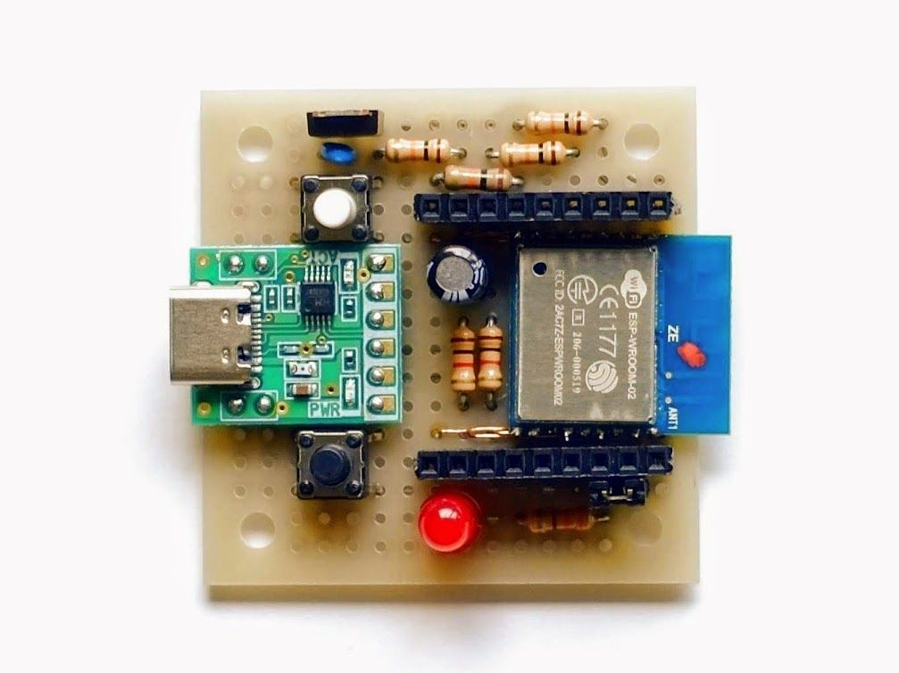
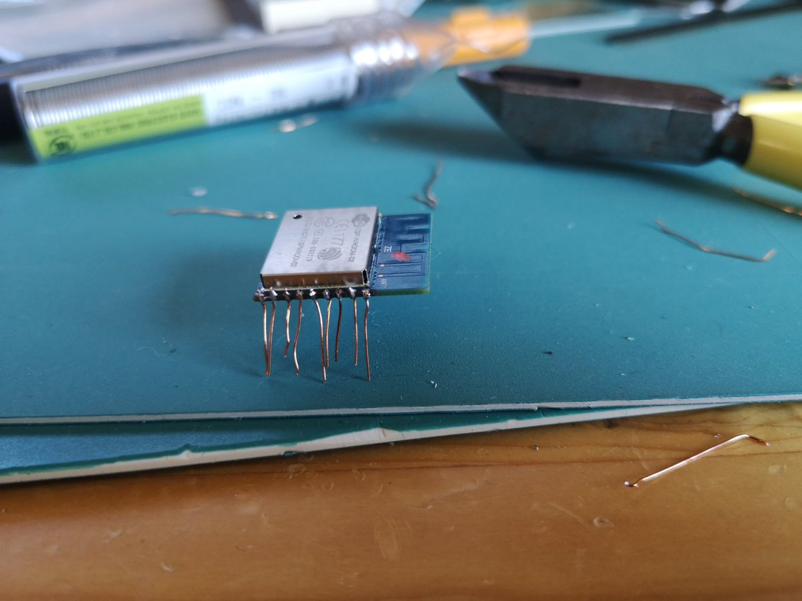
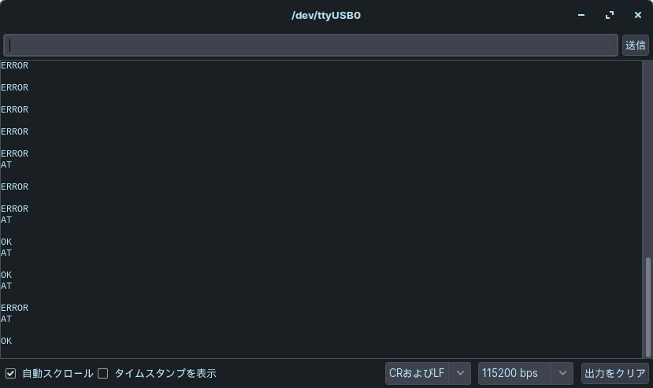

import Video from '../../../../components/Video.astro';
import video1 from './_1.mp4';

秋月の税込250円の
[ESP-WROOM-02](http://akizukidenshi.com/catalog/g/gM-09607/)を買ったので,
いつも通りボード作ってLチカしてみた.

## ESP-WROOM-02とは?

Espressif Systems社のWi-Fiモジュール.
Wi-Fiモジュールなのに,
[ESP8266EX](https://ja.wikipedia.org/wiki/ESP8266)を搭載してるが故にマイコンとして使われてしまっている可哀想なモジュール.

32bit MCU, 4MB ROM, SPI・UARTとか主要インターフェースがあり,
それに加えてWi-Fiが使える(技適あり)んだから便利, と**数年前に**流行った.
つまり, ちょっと流行りが過ぎている.

しかも, [ESP-WROOM-02D](http://akizukidenshi.com/catalog/g/gM-13289)という
後継のものがある.
周波数がD無しより改善されているらしい. そんなせいもあるのか, D無しは秋月では破格の税込250円で販売されている.

ちなみに, [ESP-WROOM-32](http://akizukidenshi.com/catalog/g/gM-11647/)という
上位機種がある.
こちらはBluetoothまで使える. ただし, 税込550円でマイコンチップにしては高級品.
なぜか持っているがまだ遊んでいない.
というかそれが必要となるほど大きなプロジェクトがない.

## マイコンボードを作る



いつも通り[45基板](http://akizukidenshi.com/catalog/g/gP-11735/)にまとめてみた.
シリアル変換は[AE-CH340E-TYPEC](http://akizukidenshi.com/catalog/g/gK-14745/)という
去年11月に発売されたモジュールを使った.
なんと, USBコネクタがType-C. モダン.
現在, シリアル変換モジュールで最安(税込480円).

### ESP-WROOM-02の取り付け

ESP-WROOM-02の端子は1.5mmピッチなので,
ユニバーサル基板に取り付けるのには工夫が必要.
世の中にはDIP化基板が出回っているが,
ブレッドボードで使う予定はないので,
UEWを使って直付けした.



### 回路

秋月の[ESP-WROOM-02開発ボード](http://akizukidenshi.com/download/ds/akizuki/AE-ESP-WROOM02-DEV.pdf)の回路図を参考に, 上手く組んだ.
本当ならいつも通り回路図を置きたいが,
先日, メインPCのOSを換装したためにまだ環境が整ってない...
水魚堂みたいに直感的に操作できる簡単なエディタがないものか.

### ハマったところ

#### ATコマンドでOKされるまで

ファームウェアを書き換えていない素のESP-WROOM-02は,
シリアル通信でコマンドを送信することによって,
本来のWi-Fiモジュールとしての設定をすることができる([参考](https://www.mkbtm.jp/?p=618)).
で, `AT`を送信すると正常なら`OK`と返ってくるはずなのが,
ここで`ERROR`ばっかし返ってきて苦労した.

結論を言うと,
シリアルコンソールの改行コードの設定を
受信**CR**, 送信**CR+LF**にする必要があった.



#### 書き込みモード切り替え

ESP-WROOM-02は, ファームウェア書き込みの際に「書き込み可能状態」にする必要がある.
具体的には, IO0(ピン8)をLOWにしながらマイコンをリセットすると, ファームウェアを書き込める状態になる.

それ自体はLPCシリーズやArduinoのブートローダと似ているので,
ArduinoIDE等で書き込む際にフローで自動化できる([参考](https://days-of-programming.blogspot.com/2018/05/esp8266dtrrts.html)).

このボードでも自動化回路を組込もうとしたのが,
CH340EにはDTRが無い! ので結局実装はしなかった.
まあ, いつかOTA書き込みを標準にしてしまえば
スイッチを押す必要は無くなるだろう...

## Lチカする

さて主題のLチカが, [Arduino IDE](https://www.arduino.cc/en/main/software)を使って爆速で終わらせる.

1. 「ファイル」>「環境設定」の「追加のボードマネージャ」に`http://arduino.esp8266.com/stable/package_esp8266com_index.json`を追加
1. 「ツールメニュー」>「ボード」>「ボードマネージャ」で**ESP8266 Community**を検索, 追加.
1. 「ツールメニュー」>「ボード」で**Generic ESP8226 Module**を選択.

で, 以下のよくみるコードを入力し, モジュールに書き込む.

```c
void setup() {
  pinMode(16, OUTPUT);
}

void loop() {
  digitalWrite(16, HIGH);
  delay(1000);
  digitalWrite(16, LOW);
  delay(1000);
}
```

ようやくLチカに成功.

<Video src={video1} loop />

次はHello,world!したい.
