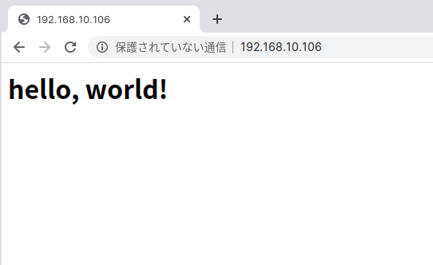
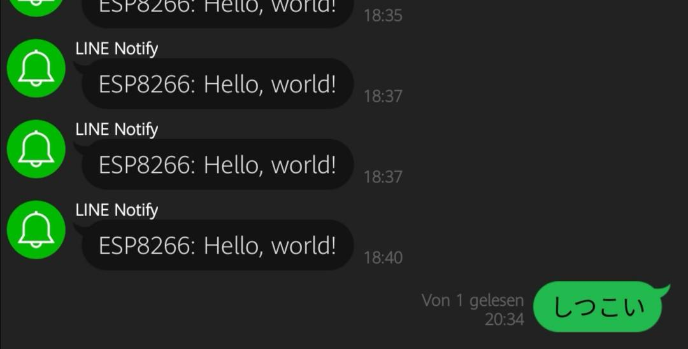

[LチカをしたESP-WROOM-02](/blog/esp8266/blink)だが,
やっぱりESP8266の威力を体験するためにはWi-Fi関連を使わねばならない.
そこで, (マイコンでは珍しく)`Hello, world!`をする.

## Web Server

Web Serverで`Hello, world!`する.
またArduino IDEでお茶を濁す.

```c
#include <ESP8266WiFi.h>
#include <ESP8266WebServer.h>

#define WIFI_SSID "your_ssid"
#define WIFI_PWD  "your_password"

ESP8266WebServer server(80);

void setup() {
  Serial.begin(115200);

  // WiFi接続
  WiFi.begin(WIFI_SSID, WIFI_PWD);
  while(WiFi.status() != WL_CONNECTED){
    delay(500);
    Serial.print(".");
  }
  Serial.println("Wi-Fi connected.");
  Serial.print("IP Address: ");
  Serial.println(WiFi.localIP());

  // Hello, wprld!送信
  server.on("/", [](){
    server.send(200, "text/html", "<h1>hello, world!</h1>");
  });

  server.begin();
}

void loop() {
  server.handleClient();
}
```

`WiFi.localIP()`でIPアドレスを取得できるので, そこに接続すると以下のように表示される.




`ESP8266WebServer`関係は色々書き方があるみたい.
ここで使っているラムダ式は
[ここ](https://iot.keicode.com/esp8266/esp8266-webserver.php)を参考にした.
`FS.h`を使って外部ファイル・画像を表示させることもできるらしい([参考](https://qiita.com/cyclon2joker/items/f293b613d866e046b062)).

## POST

将来的にWeb APIを叩くことを見据え, POSTでも`Hello, world!`してみる.
POSTの説明はWikipediaに任せようと思ったのに,
意外なことに日本語版が無かった.

[POST (HTTP) - Wikipedia](https://en.wikipedia.org/wiki/POST_(HTTP))

私は現代っ子なので, 今回は[LINE Notify](https://notify-bot.line.me/ja/)を叩いてみる.
またもやArduino IDE.

```c
#include <ESP8266WiFi.h>
#include <WiFiClientSecureAxTLS.h>

#define WIFI_SSID "your_ssid"
#define WIFI_PWD  "your_password"

const char* line_api = "notify-api.line.me";
const char* line_token = "your_token";

void line_send(String message) {
  axTLS::WiFiClientSecure client;

  // APIに接続
  if (!client.connect(line_api, 443)) {
    Serial.println("Connection failed.");
    return;
  }
  Serial.println("Connection opend.");

  String query = "message=" + message;
  client.println("POST /api/notify HTTP/1.1");
  client.println("Host: " + String(line_api));
  client.println("Authorization: Bearer " + String(line_token));
  client.println("Content-Length: " + String(query.length()));
  client.println("Content-Type: application/x-www-form-urlencoded");
  client.println();
  client.println(query);
  client.stop();

  while (client.connected()) {
    String line = client.readStringUntil('\n');
    Serial.println(line);
  }

  Serial.println("Message sent.");
}

void setup() {
  // WiFi接続
  WiFi.begin(WIFI_SSID, WIFI_PWD);
  while(WiFi.status() != WL_CONNECTED){
    delay(500);
    Serial.print(".");
  }
  Serial.println("Wi-Fi connected.");
  Serial.print("IP Address: ");
  Serial.println(WiFi.localIP());

  // Hello, world!送信
  line_send("Hello, world!");
}

void loop() {
  delay(10000);
}
```

LINE Notifyのトークン取得や叩き方については, [ここ](https://qiita.com/iitenkida7/items/576a8226ba6584864d95)を参考にした.

同じようにLINE Notifyを叩いている例があった([参考](https://next.rikunabi.com/journal/20170719_t12_iq/))が,
これはどうも動かなかった.
2017年の記事だから, 仕組みが変わったのか？
色々調べていて,
[このサイト](https://www.ioxhop.com/article/47/esp8266-esp8285-%E0%B8%81%E0%B8%B1%E0%B8%9A%E0%B8%81%E0%B8%B2%E0%B8%A3%E0%B8%AA%E0%B9%88%E0%B8%87%E0%B8%81%E0%B8%B2%E0%B8%A3%E0%B9%81%E0%B8%88%E0%B9%89%E0%B8%87%E0%B9%80%E0%B8%95%E0%B8%B7%E0%B8%AD%E0%B8%99%E0%B9%80%E0%B8%82%E0%B9%89%E0%B8%B2-line)を参考に
`WiFiClientSecureAxTLS.h`を指定してみると動いた.
一応断わっておくが, 私もタイ語は読めない.
[AxTLS](http://axtls.sourceforge.net/)は組み込み用のSSLライブラリらしいが,
具体的にそれがなんなのか,
どうしてライブラリに付属していたのかはわからない.
SSL関係の仕組みについて勉強する必要がありそう.

ちなみに, リセットボタンを連打してはいけない.



LINE Notifyは送信専用なので,
ユーザからのメッセージに対してイベントをしたいなら
[Messageing API](https://developers.line.biz/ja/services/messaging-api/)になる.
ただ, ESP8266でどれだけできるかは知らない.
