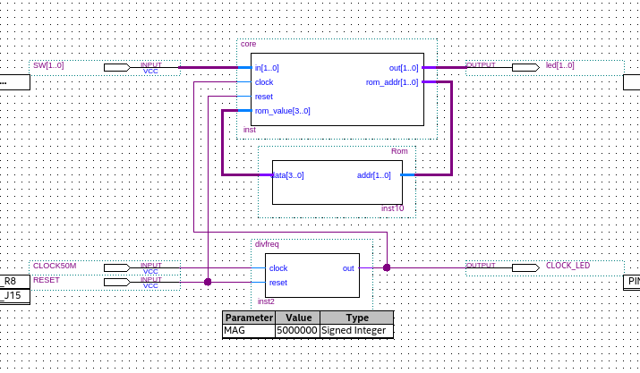

import Video from '../../../../components/Video.astro';
import video1 from './_1.mp4';
import video2 from './_2.mp4';
import video3 from './_3.mp4';

ほんの出来心で[DE0-Nano](https://www.terasic.com.tw/cgi-bin/page/archive.pl?No=593)をメルカリで買った.
FPGA初挑戦.
『[CPUの創りかた](http://siesta.la.coocan.jp/info/info.html)』を読んだことがあったので,
これを参考にとりあえず**Lチカができる小さなCPU**を作ってみた.


## 開発環境

公式のIDEをいれる.
IDEなしで開発する方法があればいずれそちらに移行する.


### Quartus Prime Lite

[Download Intel® Quartus® Prime Software](https://www.intel.com/content/www/us/en/software/programmable/quartus-prime/download.html)

DE0-Nanoは **Cyclone IV** であり,
Quartus Prime Liteに対応しているのでこれを使う.
他のStandardとかProとかは有料.
私の環境だとLiteではシミュレーションが使えなかった.
書き込みはできるので実機デバッグがんばる.

Archでは `quartus-free-quartus` $^\mathsf{AUR}$ と `quartus-free-devinfo-cyclone` $^\mathsf{AUR}$ をいれる[^1].
[^1]: [Intel Quartus Prime - ArchWiki](https://wiki.archlinux.org/title/Intel_Quartus_Prime)

```bash
yay -S quartus-free-quartus quartus-free-devinfo-cyclone libxcrypt-compat
```


### VSCode等

Quartus Primeはエディタ部分が弱いので
焼くとき以外はVSCodeとかで編集すると楽.


### プロジェクト作成 / 書き込み

以下のサイトを参考に, いい感じにやる.

[Quartus Prime で FPGA/PLD に書き込むまでの流れ - スクラッチ＆スクラップ](https://macrochelys99.hatenablog.jp/entry/2018/02/02/213838)

DE0-Nanoに載っている石は **Cyclone IV** の **EP4CE22F17C6N**.
あと基板上のLEDのピンなどは[ユーザーマニュアル](https://www.ti.com/lit/ug/tidu737/tidu737.pdf)にある.


## CPU

『CPUの創りかた』を基に, 2bitだけのCPUを作る.
構造などはほとんど同じで, ただ小さくしたようなCPU.


### 作るCPUの仕様

- ビット数は **2bit**.
命令長も基本は2bit.
つまり, ROMは4x4の2B.

- レジスタは2個 (うち1つを外部I/Oに転用).

- 加算器はレジスタの値に1を足すことができる.
繰り上がったときはCフラグを建てる.

- 他はてきとう.

以下は命令コード表 ( `W` はレジスタの値 ).
余裕でハンドアセンブルできる規模.

```
000a  ->  add W,  a   :   Wにaを加算しWに保存
0010  ->  out W       :   Wを出力
0011  ->  in  W       :   入力をWに保存
01Im  ->  out Im      :   Imを出力
10Im  ->  jmp Im      :   Imに飛ぶ
11Im  ->  jnc Im      :   Cフラグが建っていないときImに飛ぶ
```


### 実装

[xiupos/2bitcpu](https://github.com/xiupos/2bitcpu)



クロックは基板上に50MHzの水晶が載っているのでそれを[分周](https://github.com/xiupos/2bitcpu/blob/main/divfreq.v).
ROMは外部に回路を組んでも良かったが,
所詮2Bなので[仮想的にモジュールで再現](https://github.com/xiupos/2bitcpu/blob/main/rom.v).
命令デコーダ等[コア](https://github.com/xiupos/2bitcpu/blob/main/core.v)は動くようにお膳立てしてあげた.


### 動作

実装した命令を ~~無理やり~~ 使って動かしてみた.


#### Lチカ

出力の0を1秒おきに反転するだけ.

```asm
out 1     ; 0101
add W, 0  ; 0000
out 0     ; 0100
jmp 0     ; 1000
```

<Video src={video1} loop />


#### カウントアップ

0~3を順に出力するだけ.

```asm
add W, 1  ; 0001
out W     ; 0010
jnc 0     ; 1100
jmp 3     ; 1011
```

<Video src={video2} loop />


#### エコーバック

入力を出力するだけ.

```asm
in W      ; 0011
out W     ; 0010
jmp 0     ; 1000
add W, 0  ; 0000
```

<Video src={video3} loop />


2bit は小さすぎるって, なにもできん.
