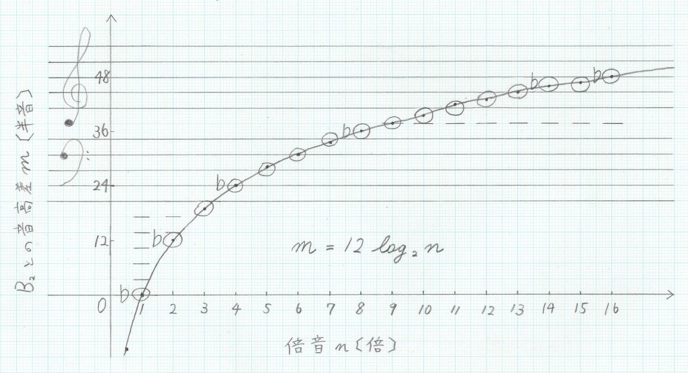

チューバが上手くならない.
上手くなるには練習せねばならない.
練習するにはカラオケへ行かねばならない.
カラオケ代もバカにはならない.
ということでチューバ[^whattuba]について色々と考えたことをまとめる.
[^whattuba]: ここでのチューバとは, 私の持っているB管4ロータリーチューバのことを指す.

## チューバの基本概念

チューバとは,
大雑把に言えば
倍音の倍数と運指から音が決まる写像である.
当然奏法だったり色々音色を変える術はあるだろうが,
音だけで言えば非常に物理的な性質を持った楽器である[^phys].
[^phys]: 当然, 任意の楽器にも言えることで, チューバだけが特別なわけではない.

## 倍音

チューバの本質は, 両端が開いた管である.
管は [固有振動数](https://ja.wikipedia.org/wiki/%E5%9B%BA%E6%9C%89%E6%8C%AF%E5%8B%95) $\omega_n$ を持ち,
マウスピースでの唇の振動がそれと一致したときに,
管内で定常波となって共鳴する.
倍音の倍数 $n$ に対し,
出る音の $\sf{B_2}$ からの音高差 $m$ [半音] は,
$$
m = 12 \log_2 n
$$
と表される.

倍数 $n = 1, \dots, 16$ について,
$m$ とそれに対応する音 $T$ についてまとめた音が次の表[^overtone]である.
一般的に用いられる倍音 $n=2,3,4,5,6,8,\dots$ は音との音高差が比較的近いことがわかる.

[^overtone]: [倍音 - Wikipedia #各倍音と倍音列](https://ja.wikipedia.org/wiki/倍音#各倍音と倍音列)

| 倍音 $n$ [倍] | $\sf{B_2}$ との音高差 $m$ [半音] |    音 $T$ [半音]    |
| :-----------: | :------------------------------: | :-----------------: |
|      $1$      |              $0.00$              | $\sf{B_2} \pm 0.00$ |
|      $2$      |             $12.00$              | $\sf{B_1} \pm 0.00$ |
|      $3$      |             $19.02$              |   $\sf{F} + 0.02$   |
|      $4$      |             $24.00$              |  $\sf{B} \pm 0.00$  |
|      $5$      |             $27.86$              |   $\sf{d} - 0.14$   |
|      $6$      |             $31.02$              |   $\sf{f} + 0.02$   |
|      $7$      |             $33.69$              |   $\sf{a} - 0.31$   |
|      $8$      |             $36.00$              |  $\sf{b} \pm 0.00$  |
|      $9$      |             $38.04$              |  $\sf{c^1} + 0.04$  |
|     $10$      |             $39.86$              |  $\sf{d^1} - 0.14$  |
|     $11$      |             $41.51$              |  $\sf{e^1} - 0.49$  |
|     $12$      |             $43.02$              |  $\sf{f^1} + 0.02$  |
|     $13$      |             $44.41$              |  $\sf{g^1} - 0.59$  |
|     $14$      |             $45.69$              | $\sf{as^1} - 0.31$  |
|     $15$      |             $46.88$              |  $\sf{a^1} - 0.12$  |
|     $16$      |             $48.00$              | $\sf{b^1} \pm 0.00$ |

また, 次の図は $n$ と $m$ のグラフにチューバの倍音列を重ねたものである.
五線譜は線の間隔が一定ではないために無理がある図であるが,
グラフと概ね一致していることがわかる.

## 運指

倍音に無い音を出すために,
チューバには4個のロータリーバルブが付いている.
簡単のため,
$i$ 番ロータリーバルブの状態を $F_i \in \{0,1\}$ で表し,
$F = F_2 \times 2^0 + F_1 \times 2^1 + F_3 \times 2^2 + F_4 \times 2^3$ とする.
$i$ 番レバーを押したとき,
つまり $F_i = 1$ のとき,
息の経路に $i$ 番管が追加され,
管長が伸び, 固有振動数が大きくなる.
$F$ について,
$0$, $1$, $2$, $3$ or $4$,
$5$, $6$ or $8$, $7$ or $9$,
$10$, $11$ or $12$, $13$, $14$, $15$
の順に音は半音ずつ下がっていく.
それを利用することで,
倍音に無い音を出すことができる.

### 運指対応表(抜粋)

実用的な範囲[^fingering]での
$(n, F) \mapsto T$ の対応は以下.

[^fingering]: 稲川榮一(2013), 『チューバ教本』, 管楽器メソッド・シリーズ, ドレミ楽譜.

| $F$ |     運指     | $n=$ |  2   |  3  |  4  |  5  |  6  |  8  |  9  | 10  |
| :-: | :----------: | ---: | :--: | :-: | :-: | :-: | :-: | :-: | :-: | :-: |
|  0  |     ○○○○     |      |  B₁  |  F  |  B  |  d  |  f  |  b  |     |     |
|  1  |     ○●○○     |      |  A₁  |  E  |  A  | des |  e  |  a  |     |     |
|  2  |     ●○○○     |      | As₁  | Es  | As  |  c  | es  | as  |     |     |
| 3,4 | ●●○○ or ○○●○ |      |  G₁  |  D  |  G  |  H  |  d  |  g  |  a  |     |
|  5  |     ○●●○     |      | Ges₁ | Des | Ges |     | des | ges |     |  b  |
| 6,8 | ●○●○ or ○○○● |      |  F₁  |  C  |  F  |  A  |  c  |  f  |     |     |
| 7,9 | ●●●○ or ○●○● |      |  E₁  | H₁  |     |     |  H  |     |     |     |

### 逆引き運指表(抜粋)

特定の音 $T$ を出したいときは以下の表.

| $n$ | E₁  | F₁  | Ges₁ | G₁  | As₁ | A₁  | B₁  | H₁  |  C  | Des |  D  | Es  |  E  |  F  | Ges |  G  | As  |  A  |  B  |  H  |  c  | des |  d  | es  |  e  |  f  | ges |  g  | as  |  a  |  b  |
| :-: | :-: | :-: | :--: | :-: | :-: | :-: | :-: | :-: | :-: | :-: | :-: | :-: | :-: | :-: | :-: | :-: | :-: | :-: | :-: | :-: | :-: | :-: | :-: | :-: | :-: | :-: | :-: | :-: | :-: | :-: | :-: |
| 10  |     |     |      |     |     |     |     |     |     |     |     |     |     |     |     |     |     |     |     |     |     |     |     |     |     |     |     |     |     |     |  5  |
|  9  |     |     |      |     |     |     |     |     |     |     |     |     |     |     |     |     |     |     |     |     |     |     |     |     |     |     |     |     |     | 3,4 |     |
|  8  |     |     |      |     |     |     |     |     |     |     |     |     |     |     |     |     |     |     |     |     |     |     |     |     | 7,9 | 6,8 |  5  | 3,4 |  2  |  1  |  0  |
|  6  |     |     |      |     |     |     |     |     |     |     |     |     |     |     |     |     |     |     |     | 7,9 | 6,8 |  5  | 3,4 |  2  |  1  |  0  |     |     |     |     |     |
|  5  |     |     |      |     |     |     |     |     |     |     |     |     |     |     |     |     |     | 6,8 |     | 3,4 |  2  |  1  |  0  |     |     |     |     |     |     |     |     |
|  4  |     |     |      |     |     |     |     |     |     |     |     |     |     | 6,8 |  5  | 3,4 |  2  |  1  |  0  |     |     |     |     |     |     |     |     |     |     |     |     |
|  3  |     |     |      |     |     |     |     | 7,9 | 6,8 |  5  | 3,4 |  2  |  1  |  0  |     |     |     |     |     |     |     |     |     |     |     |     |     |     |     |     |     |
|  2  | 7,9 | 6,8 |  5   | 3,4 |  2  |  1  |  0  |     |     |     |     |     |     |     |     |     |     |     |     |     |     |     |     |     |     |     |     |     |     |     |     |

## 全運指表

実用を無視して,
構造上考えられる全ての $(n, F) \mapsto T$ の対応をまとめてみる.

### 運指対応表

斜字以外の音は理論的な音(ずれあり).

|  $F$  |     運指     | $n=$ |  1   |   2    |   3   |   4   |   5   |   6   |  7  |   8   |  9  |  10  |  11  |  12  |  13  |  14  |  15  |  16  |
| :---: | :----------: | ---: | :--: | :----: | :---: | :---: | :---: | :---: | :-: | :---: | :-: | :--: | :--: | :--: | :--: | :--: | :--: | :--: |
|   0   |     ○○○○     |      |  B₂  |  *B₁*  |  *F*  |  *B*  |  *d*  |  *f*  |  a  |  *b*  | c¹  |  d¹  |  e¹  |  f¹  |  g¹  | as¹  |  a¹  |  b¹  |
|   1   |     ○●○○     |      |  A₂  |  *A₁*  |  *E*  |  *A*  | *des* |  *e*  | as  |  *a*  |  h  | des¹ | es¹  |  e¹  | ges¹ |  g¹  | as¹  |  a¹  |
|   2   |     ●○○○     |      | As₂  | *As₁*  | *Es*  | *As*  |  *c*  | *es*  |  g  | *as*  |  b  |  c¹  |  d¹  | es¹  |  f¹  | ges¹ |  g¹  | as¹  |
|  3,4  | ●●○○ or ○○●○ |      |  G₂  |  *G₁*  |  *D*  |  *G*  |  *H*  |  *d*  | ges |  *g*  | *a* |  h   | des¹ |  d¹  |  e¹  |  f¹  | ges¹ |  g¹  |
|   5   |     ○●●○     |      | Ges₂ | *Ges₁* | *Des* | *Ges* |   B   | *des* |  f  | *ges* | as  | *b*  |  c¹  | des¹ | es¹  |  e¹  |  f¹  | ges¹ |
|  6,8  | ●○●○ or ○○○● |      |  F₂  |  *F₁*  |  *C*  |  *F*  |  *A*  |  *c*  |  e  |  *f*  |  g  |  a   |  h   |  c¹  |  d¹  | es¹  |  e¹  |  f¹  |
|  7,9  | ●●●○ or ○●○● |      |  E₂  |  *E₁*  | *H₁*  |   E   |  As   |  *H*  | es  |   e   | ges |  as  |  b   |  h   | des¹ |  d¹  | es¹  |  e¹  |
|  10   |     ●○○●     |      | Es₂  |  Es₁   |  B₁   |  Es   |   G   |   B   |  d  |  es   |  f  |  g   |  a   |  b   |  c¹  | des¹ |  d¹  | es¹  |
| 11,12 | ●●○● or ○○●● |      |  D₂  |   D₁   |  A₁   |   D   |  Ges  |   A   | des |   d   |  e  | ges  |  as  |  a   |  h   |  c¹  | des¹ |  d¹  |
|  13   |     ○●●●     |      | Des₂ |  Des₁  |  As₁  |  Des  |   F   |  As   |  c  |  des  | es  |  f   |  g   |  as  |  b   |  h   |  c¹  | des¹ |
|  14   |     ●○●●     |      |  C₂  |   C₁   |  G₁   |   C   |   E   |   G   |  H  |   c   |  d  |  e   | ges  |  g   |  a   |  b   |  h   |  c¹  |
|  15   |     ●●●●     |      |  H₃  |   H₂   | Ges₁  |  H₁   |  Es   |  Ges  |  B  |   H   | des |  es  |  f   | ges  |  as  |  a   |  b   |  h   |

### 逆引き運指表

斜字以外の音は理論的な音(ずれあり).

| $n$ | H₃  | C₂  | Des₂ |  D₂   | Es₂ | E₂  | F₂  | Ges₂ | G₂  | As₂ | A₂  | B₂  | H₂  | C₁  | Des₁ |  D₁   | Es₁ |  E₁   |  F₁   | Ges₁ |  G₁   | As₁ |  A₁   | B₁  |  H₁   |   C   | Des |   D   | Es  |  E  |   F   |  Ges  |   G   | As  |   A   |  B  |   H   |   c   |  des  |   d   | es  |   e   |   f   |  ges  |   g   |  as   |   a   |  b  |   h   |  c¹   | des¹  |  d¹   | es¹ | e¹  | f¹  | ges¹ | g¹  | as¹ | a¹  | b¹  |
| :-: | :-: | :-: | :--: | :---: | :-: | :-: | :-: | :--: | :-: | :-: | :-: | :-: | :-: | :-: | :--: | :---: | :-: | :---: | :---: | :--: | :---: | :-: | :---: | :-: | :---: | :---: | :-: | :---: | :-: | :-: | :---: | :---: | :---: | :-: | :---: | :-: | :---: | :---: | :---: | :---: | :-: | :---: | :---: | :---: | :---: | :---: | :---: | :-: | :---: | :---: | :---: | :---: | :-: | :-: | :-: | :--: | :-: | :-: | :-: | :-: |
| 16  |     |     |      |       |     |     |     |      |     |     |     |     |     |     |      |       |     |       |       |      |       |     |       |     |       |       |     |       |     |     |       |       |       |     |       |     |       |       |       |       |     |       |       |       |       |       |       |     |  15   |  14   |  13   | 11,12 | 10  | 7,9 | 6,8 |  5   | 3,4 |  2  |  1  |  0  |
| 15  |     |     |      |       |     |     |     |      |     |     |     |     |     |     |      |       |     |       |       |      |       |     |       |     |       |       |     |       |     |     |       |       |       |     |       |     |       |       |       |       |     |       |       |       |       |       |       | 15  |  14   |  13   | 11,12 |  10   | 7,9 | 6,8 |  5  | 3,4  |  2  |  1  |  0  |     |
| 14  |     |     |      |       |     |     |     |      |     |     |     |     |     |     |      |       |     |       |       |      |       |     |       |     |       |       |     |       |     |     |       |       |       |     |       |     |       |       |       |       |     |       |       |       |       |       |  15   | 14  |  13   | 11,12 |  10   |  7,9  | 6,8 |  5  | 3,4 |  2   |  1  |  0  |     |     |
| 13  |     |     |      |       |     |     |     |      |     |     |     |     |     |     |      |       |     |       |       |      |       |     |       |     |       |       |     |       |     |     |       |       |       |     |       |     |       |       |       |       |     |       |       |       |       |  15   |  14   | 13  | 11,12 |  10   |  7,9  |  6,8  |  5  | 3,4 |  2  |  1   |  0  |     |     |     |
| 12  |     |     |      |       |     |     |     |      |     |     |     |     |     |     |      |       |     |       |       |      |       |     |       |     |       |       |     |       |     |     |       |       |       |     |       |     |       |       |       |       |     |       |       |  15   |  14   |  13   | 11,12 | 10  |  7,9  |  6,8  |   5   |  3,4  |  2  |  1  |  0  |      |     |     |     |     |
| 11  |     |     |      |       |     |     |     |      |     |     |     |     |     |     |      |       |     |       |       |      |       |     |       |     |       |       |     |       |     |     |       |       |       |     |       |     |       |       |       |       |     |       |  15   |  14   |  13   | 11,12 |  10   | 7,9 |  6,8  |   5   |  3,4  |   2   |  1  |  0  |     |      |     |     |     |     |
| 10  |     |     |      |       |     |     |     |      |     |     |     |     |     |     |      |       |     |       |       |      |       |     |       |     |       |       |     |       |     |     |       |       |       |     |       |     |       |       |       |       | 15  |  14   |  13   | 11,12 |  10   |  7,9  |  6,8  | *5* |  3,4  |   2   |   1   |   0   |     |     |     |      |     |     |     |     |
|  9  |     |     |      |       |     |     |     |      |     |     |     |     |     |     |      |       |     |       |       |      |       |     |       |     |       |       |     |       |     |     |       |       |       |     |       |     |       |       |  15   |  14   | 13  | 11,12 |  10   |  7,9  |  6,8  |   5   | *3,4* |  2  |   1   |   0   |       |       |     |     |     |      |     |     |     |     |
|  8  |     |     |      |       |     |     |     |      |     |     |     |     |     |     |      |       |     |       |       |      |       |     |       |     |       |       |     |       |     |     |       |       |       |     |       |     |  15   |  14   |  13   | 11,12 | 10  | *7,9* | *6,8* |  *5*  | *3,4* |  *2*  |  *1*  | *0* |       |       |       |       |     |     |     |      |     |     |     |     |
|  7  |     |     |      |       |     |     |     |      |     |     |     |     |     |     |      |       |     |       |       |      |       |     |       |     |       |       |     |       |     |     |       |       |       |     |       | 15  |  14   |  13   | 11,12 |  10   | 7,9 |  6,8  |   5   |  3,4  |   2   |   1   |   0   |     |       |       |       |       |     |     |     |      |     |     |     |     |
|  6  |     |     |      |       |     |     |     |      |     |     |     |     |     |     |      |       |     |       |       |      |       |     |       |     |       |       |     |       |     |     |       |  15   |  14   | 13  | 11,12 | 10  | *7,9* | *6,8* |  *5*  | *3,4* | *2* |  *1*  |  *0*  |       |       |       |       |     |       |       |       |       |     |     |     |      |     |     |     |     |
|  5  |     |     |      |       |     |     |     |      |     |     |     |     |     |     |      |       |     |       |       |      |       |     |       |     |       |       |     |       | 15  | 14  |  13   | 11,12 |  10   | 7,9 | *6,8* |  5  | *3,4* |  *2*  |  *1*  |  *0*  |     |       |       |       |       |       |       |     |       |       |       |       |     |     |     |      |     |     |     |     |
|  4  |     |     |      |       |     |     |     |      |     |     |     |     |     |     |      |       |     |       |       |      |       |     |       |     |  15   |  14   | 13  | 11,12 | 10  | 7,9 | *6,8* |  *5*  | *3,4* | *2* |  *1*  | *0* |       |       |       |       |     |       |       |       |       |       |       |     |       |       |       |       |     |     |     |      |     |     |     |     |
|  3  |     |     |      |       |     |     |     |      |     |     |     |     |     |     |      |       |     |       |       |  15  |  14   | 13  | 11,12 | 10  | *7,9* | *6,8* | *5* | *3,4* | *2* | *1* |  *0*  |       |       |     |       |     |       |       |       |       |     |       |       |       |       |       |       |     |       |       |       |       |     |     |     |      |     |     |     |     |
|  2  |     |     |      |       |     |     |     |      |     |     |     |     | 15  | 14  |  13  | 11,12 | 10  | *7,9* | *6,8* | *5*  | *3,4* | *2* |  *1*  | *0* |       |       |     |       |     |     |       |       |       |     |       |     |       |       |       |       |     |       |       |       |       |       |       |     |       |       |       |       |     |     |     |      |     |     |     |     |
|  1  | 15  | 14  |  13  | 11,12 | 10  | 7,9 | 6,8 |  5   | 3,4 |  2  |  1  |  0  |     |     |      |       |     |       |       |      |       |     |       |     |       |       |     |       |     |     |       |       |       |     |       |     |       |       |       |       |     |       |       |       |       |       |       |     |       |       |       |       |     |     |     |      |     |     |     |     |

本当に出るかは試してないし,
そんな実力も無いので未検証.
あとこんなこと考えても上達はしないので,
大人しく練習するべき. します.
