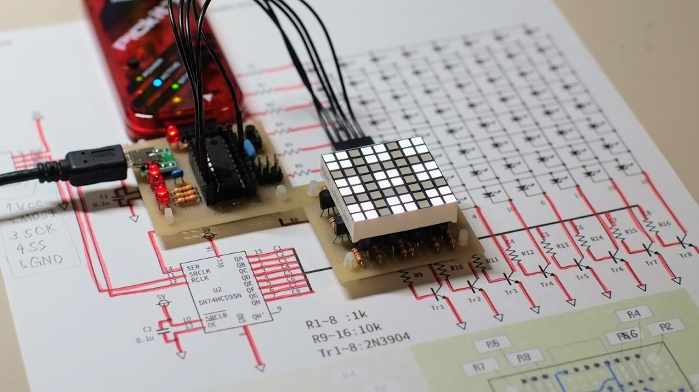
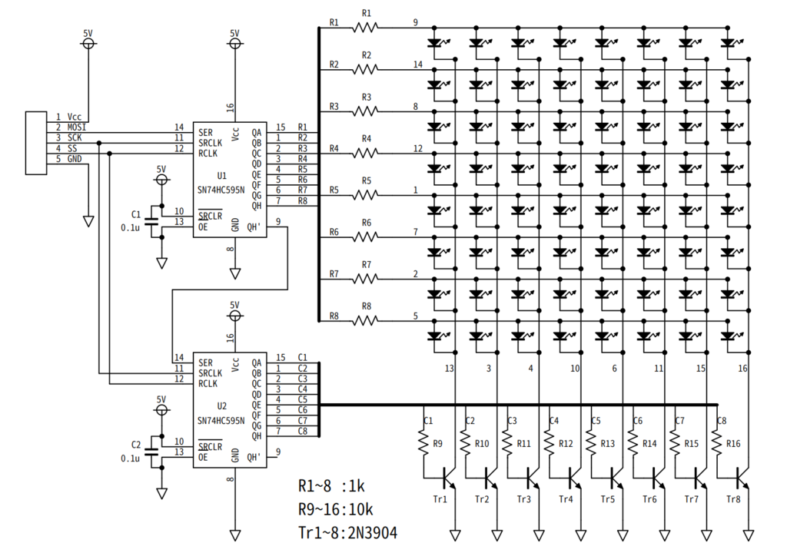
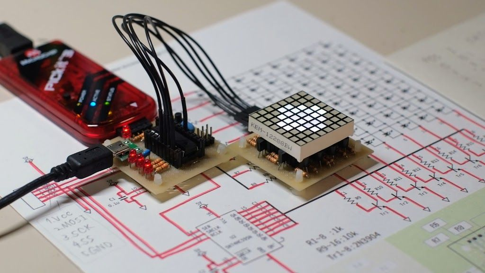
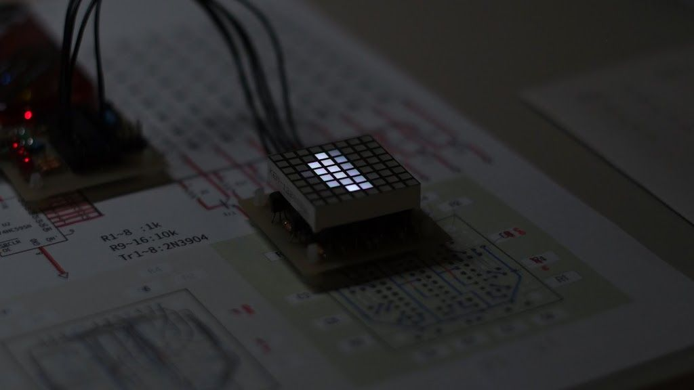

import Video from '../../../../components/Video.astro';
import video1 from './_1.mp4';

16F84Aのコツをつかんできたため, 思い切って[8x8マトリクスLED](http://www.akiba-led.jp/product/1068)の制御をしてみた.

といっても, 16F84AにはI/Oピンが13本しかないので, 16本のマトリクスLEDを制御するために[シフトレジスタ(74HC595)](http://akizukidenshi.com/catalog/g/gI-08605/)を使う.
例のごとくブレットボードにこの量の配線を毎回するのは嫌だから, いつもの[45x45mm基板](http://akizukidenshi.com/catalog/g/gP-11735/)に組んだ. UEW配線初挑戦 !

基板の写真は[こちら](./_5.jpg).
あと, Timer0を使ってより高度(?)な制御にも挑戦. 1msごとに一列ずつ表示することで自由に表示できるようにしてみたり.

シャッタースピードを上げて撮るとこの通り. 一列ずつ表示されている.

アニメーション（？）だってできる.

<Video src={video1} loop />

ソースコードは[こちら](https://gist.github.com/xiupos/fda8e0cb926c7603b90fe39fcf1147e4).
main1.asmがトップ画像の表示で, main2.asmがダイヤみたいなやつ, main3.asmがアニメーション.
