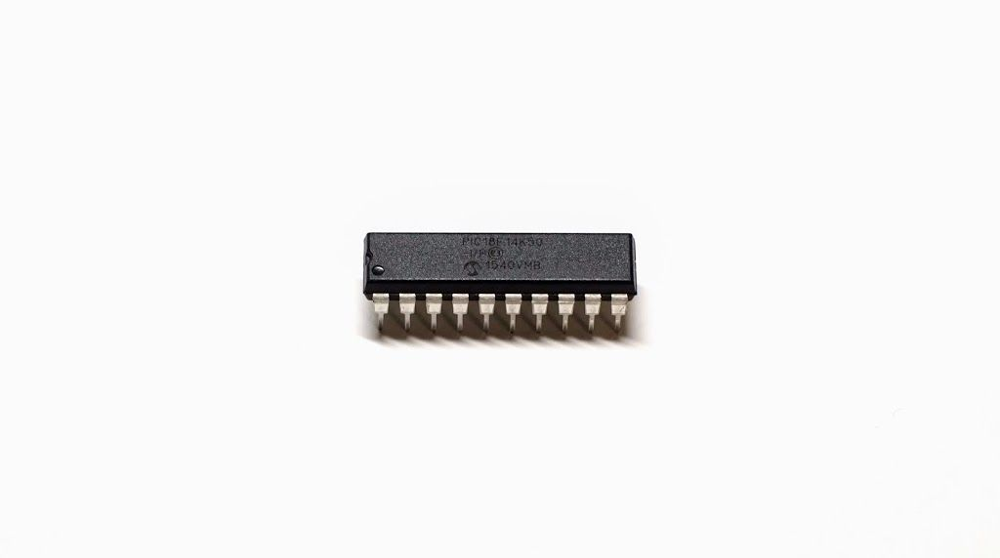
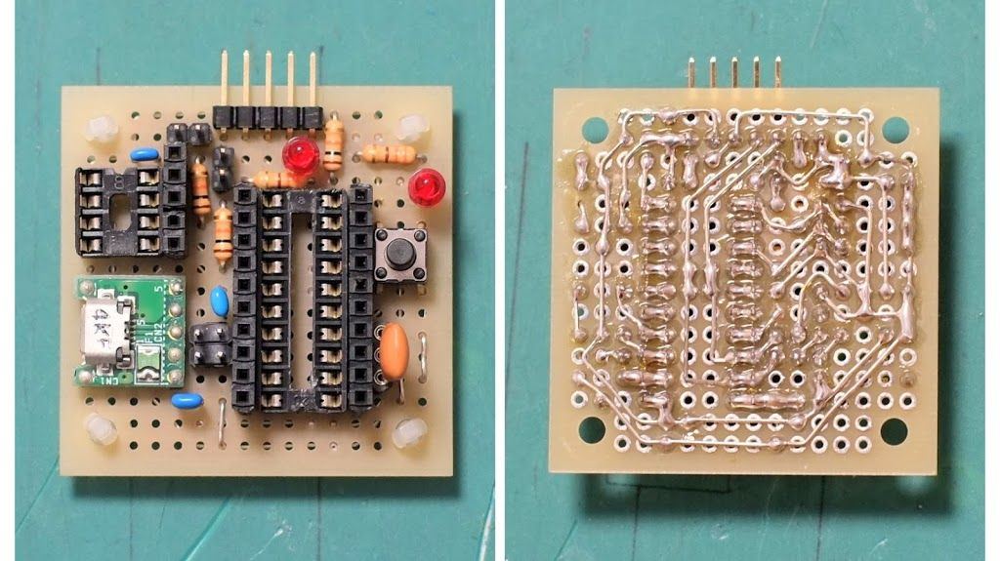
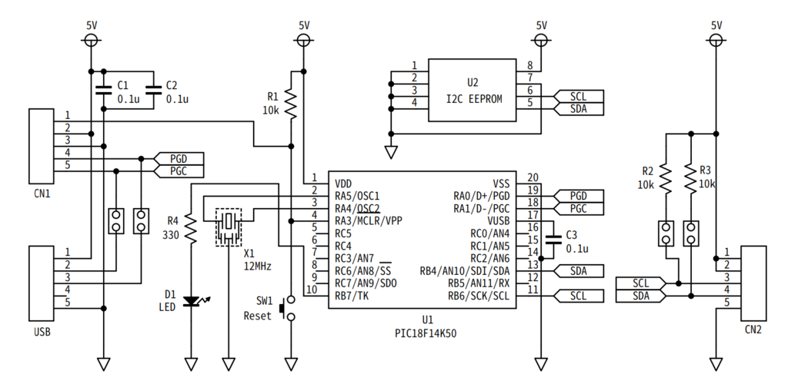

最近, アセンブリを書くことに疲れてきたので,
しばらくはC言語で開発していきたいと思う.
しかし, PIC16F84AのC言語を使うくらいだったらアセンブリの方が使いやすいし(本末転倒),
せっかくなので他のPICをはじめたいと思った.

## なぜPIC18F14K50か?

まぁ, 理由なんて「USBを使えるようになったい」の一言に尽くが, 無理して他の理由も絞り出してみる.

### 理由 1 : PIC18シリーズだから

憧れたん. PIC12でもなく, PIC16でもなく, PIC18であるところに憧れたん. それだけ.

※PIC18シリーズは「ハイエンドシリーズ」であり,
特にPIC18 Kシリーズは低消費電力・高パフォーマンスアプリケーションに対応したシリーズと位置づけられている,
そう. ([PIC (コントローラ) - Wikipedia](https://ja.wikipedia.org/wiki/PIC_(%E3%82%B3%E3%83%B3%E3%83%88%E3%83%AD%E3%83%BC%E3%83%A9)#8bit_PIC%E3%82%B7%E3%83%AA%E3%83%BC%E3%82%BA%EF%BC%88%E3%83%87%E3%83%BC%E3%82%BF%E3%83%A1%E3%83%A2%E3%83%AA%E3%81%8C8%E3%83%93%E3%83%83%E3%83%88%E5%B9%85%EF%BC%89)より)

### 理由 2 : 高性能, 高機能だから

以下に性能, 機能の比較の表を載せておく.
が, 16F84Aだけだと比較にならないので, 16F1827も参考までに載せておく.
尚, 16F1827は16F84Aと基本的なピンの配置が同じため,
以前作った[16F84Aボード](/blog/pic16f84a/board)に差し替えるだけで使える.
気が向いたら使う.

|  | [16F84A](http://akizukidenshi.com/catalog/g/gI-00097/) | [16F1827](http://akizukidenshi.com/catalog/g/gI-04430/) | [18F14K50](http://akizukidenshi.com/catalog/g/gI-03031/) |
|:-:|--:|--:|--:|
| パッケージ | 18ピンDIP | 18ピンDIP | 20ピンDIP |
| プログラムメモリ | 1kワード | 4kワード | 8kワード |
| データRAM(バイト) | 68 | 384 | 768 |
| EEPROM(バイト) | 64 | 256 | 256 |
| 最大クロック | 20MHz | 32MHz | 48MHz |
| 内蔵クロック | - | 32MHz | 32MHz |
| I/O(本) | 13 | 16 | 17 |
| 8bitタイマー(個) | 1 | 4 | 1 |
| 16bitタイマー(個) | - | 1 | 3 |
| USART | - | 有 | 有 |
| SPI | - | 有 | 有 |
| I2C | - | 有 | 有 |
| USB | - | - | 有 |
| 秋月での値段(円) | 300 | 150 | 220 |

※2018年4月3日現在の情報.

見ての通り, PIC16F84Aと比べて圧倒的に高性能, 高機能.
特にSPIとかI2Cとかはあるだけで助かる.

以上の2つ(+USB機能)が18F14K50を選んだ理由.
他の理由も思いついたら書き足していく.

## PIC18F14K50ボードを作る

いちいちブレッドボードで回路を組むのは嫌いなので,
例の如くまたマイコンボードを作った.

前回のマトリクスLEDボードの時はUEWを使ったが,
今回はそれほどでもなかったので, 普通に配線した.
写真左上のICソケットはI2C EEPROM用で,
近くのピンソケットは[AQM0802A](http://akizukidenshi.com/catalog/g/gP-06669/)を直接挿せるようにしてみた[^1].
近くのジャンパピンはプルアップ用,
USB近くのジャンパピンはD+, D-をPICから切り離すためにある.
もしもの時用...?

[^1]: AQM0802Aは電源が3.3Vだが, 使えた.
[コントローラICのデータシート](http://akizukidenshi.com/download/ds/sitronix/st7032.pdf)には「2.7 to 5.5 V」とある.

